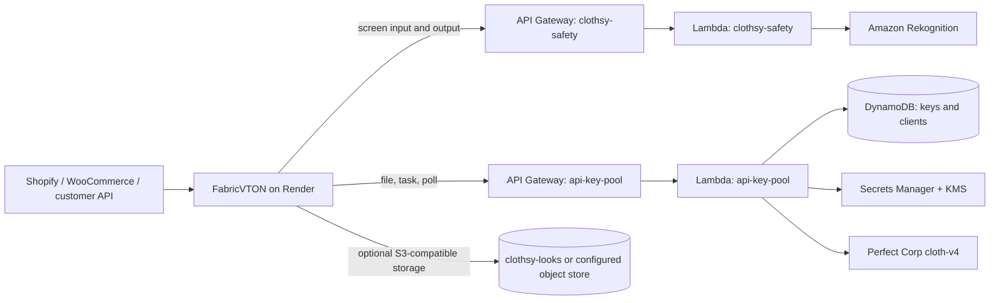

# Clothsy AI on AWS

**Verified snapshot:** 1 October 2026, 17:29 IST. Account `251929332238`, region `us-east-1`. This document combines a read-only AWS CLI inventory with the code in this repository. Counts and health states can change after this snapshot. No secret values, customer images, or customer records were read for this inventory.

## What runs where

AWS hosts two server-side services: the Perfect Corp credential pool and a Rekognition adapter for basic safety checks. The Clothsy customer API, credit ledger, Shopify and WooCommerce routes, and safety decisions run in the `fabricvton` backend on Render. The customer portal and SDK are separate application code. A customer's `clothsy_live_...` API key is **not** one of the 193 Perfect Corp keys; its hash and credits are held in the backend database.



The backend supplies `x-client-id` and `x-client-token` from its server-side secret store to both AWS APIs. It does not require AWS IAM credentials. The two AWS Lambdas use their own IAM roles. HTTPS protects requests in transit; the services necessarily decrypt requests to process them.

The backend code reads `CLOTHES_PROXY_BASE`, `CLOTHES_PROXY_CLIENT_ID`, and `CLOTHES_PROXY_TOKEN` for RPAPIR, and `SAFETY_PROXY_BASE` for screening. `PUBLIC_APP_URL` supplies its signed garment/result link domain. `SHARE_S3_ENDPOINT`, `SHARE_S3_BUCKET`, `SHARE_S3_REGION`, and two storage credentials select either AWS S3 or another S3-compatible object store. These are **code contracts**, not a verified dump of Render environment values. [`fabricvton/app/engine.server.ts`](fabricvton/app/engine.server.ts) still supports a direct `ENGINE_*` provider mode if the proxy base is absent; confirm the deployed Render configuration before claiming every live request traverses RPAPIR.

### One try-on request

1. The Render backend validates the shopper or customer API request and asks the safety API to screen the person and garment. The safety API calls Rekognition and returns observations; Render applies the policy.
2. Render asks RPAPIR to register the person image with Perfect Corp's File API. RPAPIR chooses a key and returns a provider-signed upload URL plus `x-key-session`. Render uploads bytes to that temporary URL.
3. Render calls RPAPIR's task route with the file ID, garment image URL, category, and the same session. RPAPIR sends the request to Perfect Corp under the pinned provider key.
4. Render polls through RPAPIR. RPAPIR looks up the task's original key. Before a result is shown or shared, Render downloads and screens the generated image.
5. The account or store credit ledger is managed in the Render backend database, not in DynamoDB. A failed start is refunded by the backend code; this AWS inventory does not verify a complete live try-on.

## Live AWS resources

| Resource | Live configuration | Role |
| --- | --- | --- |
| HTTP API `api-key-pool` (`eqadsa6xp8`) | `https://eqadsa6xp8.execute-api.us-east-1.amazonaws.com`; `$default` stage auto-deploys; 0.7 requests/second, burst 2 | Receives `POST /v1/file`, `POST /v1/request`, `GET /v1/request/{taskId}` |
| Lambda `api-key-pool` | Node.js 24, 512 MiB, 30-second timeout; active; last modified **28 Sep 2026 13:55 UTC** | Authenticates the backend, selects Perfect Corp credentials, forwards requests, tracks file sessions and tasks |
| DynamoDB `api-key-pool-keys` | On-demand, encrypted, point-in-time recovery enabled; `provider-eligible-index`; `expiresAt` TTL enabled | Provider key health, leases, 24-hour workflow and task mappings |
| DynamoDB `api-key-pool-clients` | On-demand, encrypted, point-in-time recovery enabled | Client ID, token hash, revocation metadata; **one client record** at snapshot time |
| Secrets Manager | Four `api-key-pool/providers/perfectcorp/group-{4,5,6,7}` secrets | Grouped provider credential values; not returned by the API |
| KMS `alias/api-key-pool-secrets` | Customer-managed key | Encrypts the grouped provider secrets through Secrets Manager |
| HTTP API `clothsy-safety` (`zyfl4u1zef`) | `https://zyfl4u1zef.execute-api.us-east-1.amazonaws.com`; `$default` stage auto-deploys; 5 requests/second, burst 10 | Receives `POST /v1/screen` |
| Lambda `clothsy-safety` | Node.js 24, 512 MiB, 25-second timeout; active; last modified **29 Sep 2026 19:35 UTC** | Authenticates the backend and invokes Rekognition; does not persist images |
| S3 `clothsy-looks` | `us-east-1`; public access blocked; default SSE-S3 (`AES256`); objects under `looks/` expire after 35 days | Private image storage available to the backend's S3-compatible storage adapter. The live Render storage endpoint was not verified. |
| S3 `clothsy-safety-tfstate-251929332238` | Public access blocked; default SSE-S3; versioning enabled | Remote Terraform state for the safety stack, with S3 lockfile |

There are four CloudWatch log groups: `/aws/lambda/api-key-pool` and `/aws/apigateway/api-key-pool` retain 30 days; `/aws/lambda/clothsy-safety` and `/aws/apigateway/clothsy-safety` retain 7 days. The proxy API access log records request ID, route, status, latency, and source IP; the safety API access log omits source IP. Neither access log format includes bodies or credentials. The account's Lambda concurrency limit is **10**, shared by both functions and other Lambda use.

AWS also contains `edgevault-deploy-251929332238`, `fashn-vton-assets-251929332238`, and `innotech-opsbucket-akbv2isqv3tz` S3 buckets. Their ownership and use in the current Clothsy try-on flow were not established here; do not treat them as part of either Terraform stack.

## Provider key rotation and task continuity

At the snapshot, the `perfectcorp` pool had **193 key records, all `ACTIVE`**. Counts for `QUOTA_EXHAUSTED`, `AUTH_FAILED`, `TEMP_DISABLED`, and `DISABLED` were each zero. DynamoDB's approximate table count also includes temporary workflow/task records, so it is not a provider-key count.

The proxy queries eligible keys through `provider-eligible-index` and conditionally claims a 30-second lease. Credential values are read from Secrets Manager and cached in the Lambda process for five minutes. File registration returns an `x-key-session`; the backend sends that session when starting the task so its provider file ID stays on the same key. The proxy stores the task-to-key mapping and polls the task with the key that created it. Session and task mappings expire after 24 hours.

Provider credit exhaustion quarantines a key until an operator re-enables it. Authentication failure also quarantines it. Temporary rate limiting triggers a cooldown. Ordinary input errors do not rotate credentials. If a pinned key fails after a file upload, the backend can restart the **whole** file registration/upload/task sequence on another key; it cannot transfer a provider file ID between keys. The API Gateway throttle applies across routes, including polling. Key rotation does not remove Perfect Corp's per-IP limit or create additional provider capacity.

The source of this behavior is [`RPAPIR-main/src/handler.ts`](RPAPIR-main/src/handler.ts), [`keyPool.ts`](RPAPIR-main/src/keyPool.ts), [`taskStore.ts`](RPAPIR-main/src/taskStore.ts), and [`fabricvton/app/engine.server.ts`](fabricvton/app/engine.server.ts). The deployed Lambda's build hash was read, but it was not compared with a newly built artifact; source-to-deployment equivalence is therefore unverified.

## Safety screening

The safety Lambda accepts a base64 JPEG or PNG (up to 4 MiB) and exposes only four fixed Rekognition actions: `DetectFaces`, `DetectLabels`, `DetectModerationLabels`, and `RecognizeCelebrities`. It checks the same client-token hash table as the proxy. The Lambda does not save image bytes or results; API access logs omit image bodies. An AWS Organizations effective AI-services opt-out policy reports `rekognition: optOut` for this account.

The **backend** makes the allow/block decisions: consent, one clearly visible adult face, multiple-person detection, celebrity detection, moderation labels, and blocked garment names/labels. It screens the person and garment before sending a try-on to RPAPIR and screens generated output before serving it. Missing or unavailable screening fails closed. See [`safety-aws/handler.mjs`](safety-aws/handler.mjs), [`fabricvton/app/safety.server.ts`](fabricvton/app/safety.server.ts), and the storefront/API entry points in [`fabricvton/app/tryon.server.ts`](fabricvton/app/tryon.server.ts) and [`fabricvton/app/invoices/playground.server.ts`](fabricvton/app/invoices/playground.server.ts).

These are **basic checks, not all 11 guardrails** in [`safety-guardrails.md`](safety-guardrails.md). At the snapshot there was no second age model (one is being added; see the change section below). There is no vetted CSAM hash matching, human-parsing coverage check, C2PA signing, or durable abuse-enforcement workflow in this AWS deployment. RPAPIR does not validate a signed safety verdict; a caller with its valid client credential can invoke the proxy directly. The AWS safety service also cannot prove how the Render deployment is configured without checking that deployment separately.

## Security boundary and deployment status

Both APIs use the generated `execute-api` endpoints. The live account has **no API Gateway custom domain, mTLS configuration, API Gateway authorizer, or regional WAF ACL**. Lambda enforces the client token; API Gateway enforces HTTPS and throttling. The proxy's IAM role can access its DynamoDB tables and provider secrets; the safety role can read the client table and invoke the four Rekognition actions. Provider keys remain on the AWS side. Customers' API keys and balances remain in the backend database.

The optional Google Sheet sync Lambda/EventBridge rule in [`RPAPIR-main/terraform/sheet_sync.tf`](RPAPIR-main/terraform/sheet_sync.tf) is **not deployed**: no corresponding Lambda, schedule, or service-account secret was found. The optional RPAPIR custom-domain/mTLS resources in Terraform are also absent. The safety stack uses a configured remote S3 Terraform backend. The checked-in RPAPIR Terraform has no backend configuration or state file; do not run `terraform apply` from a fresh checkout without first locating and reconciling the original state.

The live Lambda modification dates above are AWS facts. They do **not** prove that the current Render release, Shopify release, or WooCommerce plugin version is using these services, nor that the newest repository commit is deployed to either Lambda. Live Lambda environment-variable values and Render settings were not inspected; runtime behavior described above comes from repository code and nonsecret resource metadata. This inventory did not run a customer try-on or incur provider units.

## Change after the snapshot: second age estimator (1 October 2026)

The snapshot above predates this change. The backend refused every face whose Rekognition age midpoint was under 25, because policy G1's second estimator did not exist. That refused most adults who look 18 to 24. The fix follows G1 as written:

| Resource | State | Role |
| --- | --- | --- |
| ECR `clothsy-age` | Created (immutable tags, scan on push, keeps the newest five images) | MiVOLO v2 Lambda image, `clothsy-age@sha256:8595c0ae…` pushed |
| IAM role `clothsy-age-lambda-role`, log group `/aws/lambda/clothsy-age` (7 days) | Created | Logs, and `dynamodb:GetItem` on `api-key-pool-clients` only |
| Lambda `clothsy-age` (container, x86_64, 3008 MB, the account's current maximum, 28 s) + route `POST /v1/age` on `clothsy-safety` | Applied (route live; warm-up every 5 minutes) | Second age estimate from the image plus Rekognition's face and person boxes |

The existing `clothsy-safety` Lambda, its route, and RPAPIR (`api-key-pool`, its tables, secrets and Lambda) are unchanged; RPAPIR needs no change. The new Lambda shares the account's Lambda concurrency limit of 10. The backend change (`fabricvton/app/safety.server.ts`) applies the G1 bands and falls back to the old strict rule while `/v1/age` is absent or failing. Details and measurements are in [`safety-aws/README.md`](safety-aws/README.md#second-age-estimator-clothsy-age-1-october-2026).

## Read-only verification commands

Run these with an AWS profile authorized for account `251929332238` in `us-east-1`. They report metadata only:

```bash
aws sts get-caller-identity
aws lambda list-functions --region us-east-1 --query 'Functions[].{Name:FunctionName,LastModified:LastModified,State:State}'
aws apigatewayv2 get-apis --region us-east-1 --query 'Items[].{Name:Name,ApiId:ApiId,Endpoint:ApiEndpoint}'
aws dynamodb describe-table --table-name api-key-pool-keys --region us-east-1 --query 'Table.{Status:TableStatus,ApproximateItems:ItemCount}'
aws logs describe-log-groups --region us-east-1 --log-group-name-prefix /aws/ --query 'logGroups[].{Name:logGroupName,Retention:retentionInDays}'
```

The credential-pool implementation and deployment procedure are in [`RPAPIR-main/README.md`](RPAPIR-main/README.md). The safety Terraform and its original deployment notes are in [`safety-aws/README.md`](safety-aws/README.md). The backend's proxy contract is in [`fabricvton/PROXY_INTEGRATION.md`](fabricvton/PROXY_INTEGRATION.md). Treat older deployment notes as historical when they conflict with this dated live-resource snapshot; verify current AWS and Render settings before a change.
