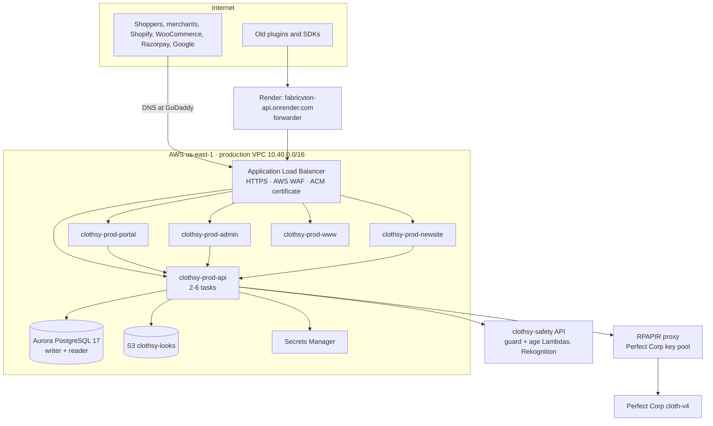

# Clothsy on AWS: the move from Render, Vercel and Neon

**State as of 3 October 2026.** Account `251929332238`, region `us-east-1` (N. Virginia). This document records what was moved, how it runs now, how to operate it, what is still open, and the one step left for the Shopify apps. It contains no secret values; where a secret matters, it names the place it lives.

Contents

1. [Summary](#1-summary)
2. [Before and after](#2-before-and-after)
3. [Live addresses](#3-live-addresses)
4. [Architecture](#4-architecture)
5. [DNS at GoDaddy](#5-dns-at-godaddy)
6. [Configuration and secrets](#6-configuration-and-secrets)
7. [Database](#7-database)
8. [Deploying](#8-deploying)
9. [Terraform](#9-terraform)
10. [Custom domains and certificates](#10-custom-domains-and-certificates)
11. [The Render forwarder](#11-the-render-forwarder)
12. [Shopify: the remaining step (for the teammate with Shopify access)](#12-shopify-the-remaining-step)
13. [Verification done at the cutover](#13-verification-done-at-the-cutover)
14. [What is left](#14-what-is-left)
15. [Rollback](#15-rollback)
16. [Runbook: everyday tasks](#16-runbook-everyday-tasks)
17. [How the move went: timeline, problems and fixes](#17-how-the-move-went)
18. [Cost](#18-cost)
19. [Reference: names and identifiers](#19-reference-names-and-identifiers)

---

## 1. Summary

- **Every Clothsy app now runs on AWS**: the backend (`fabricvton`), the merchant portal (`custom-store`), the admin dashboard (`admin-dashboard`), the Clothsy AI site (`fabricvton-newsite`) and the FabricVTON site (`fabricvton-nextjs`). Each is a container service on **Amazon ECS Express Mode** (Fargate), behind an AWS load balancer with HTTPS and AWS WAF.
- **The data moved from Neon to Amazon Aurora PostgreSQL** (Serverless v2). The final copy matched Neon table for table.
- **The live domains point at AWS** since the cutover on 3 October 2026: `www.fabricvton.com`, `clothsyai.fabricvton.com`, `app.clothsyai.fabricvton.com`, `admin.clothsyai.fabricvton.com`, and the new backend address `api.clothsyai.fabricvton.com`.
- **The old backend address `fabricvton-api.onrender.com` still works.** The Render service now runs a small forwarder that passes every request to the AWS backend, so released WooCommerce plugins, SDK versions and old links keep working.
- **Two environments**: `staging` (for testing changes) and `prod` (what customers use). They are separate: own network, database, secrets, services and load balancer.
- **One step remains**: deploying the two Shopify app configurations so Shopify calls the AWS backend directly (section 12). Until then Shopify traffic still reaches AWS, through the Render forwarder.
- **Everything is in code**: Terraform in `infra/`, deploy and maintenance scripts in `infra/scripts/`, GitHub Actions workflows in `.github/workflows/`.

## 2. Before and after

| Part | Before | Now |
|---|---|---|
| Backend `fabricvton` (React Router, Shopify app, customer API, Woo routes) | Render web service `fabricvton-api.onrender.com` | ECS Express Mode service `clothsy-prod-api`, at `api.clothsyai.fabricvton.com` |
| Merchant portal `custom-store` (Next.js) | Vercel, `app.clothsyai.fabricvton.com` | ECS service `clothsy-prod-portal`, same domain |
| Admin dashboard `admin-dashboard` (Next.js) | Vercel, `admin.clothsyai.fabricvton.com` | ECS service `clothsy-prod-admin`, same domain |
| Clothsy AI site `fabricvton-newsite` (Next.js) | Vercel, `clothsyai.fabricvton.com` | ECS service `clothsy-prod-newsite`, same domain |
| FabricVTON site `fabricvton-nextjs` (Next.js) | Vercel, `www.fabricvton.com` | ECS service `clothsy-prod-www`, same domain |
| Database (Postgres, Prisma) | Neon (PostgreSQL 18), shared with another project's tables | Aurora PostgreSQL 17 Serverless v2, Clothsy tables only |
| Shared-look images | S3 bucket `clothsy-looks`, reached with a stored access key | Same bucket, reached with the service's IAM role (no stored key) |
| Safety guardrails, Perfect Corp key pool (RPAPIR) | Already on AWS (API Gateway + Lambda) | Unchanged; the backend now calls them from inside the same region |
| DNS | GoDaddy, records pointing at Vercel | GoDaddy, records pointing at the AWS load balancer |
| `fabricvton-api.onrender.com` | The backend | A forwarder to the AWS backend |
| Bare `fabricvton.com` | Vercel, redirects to `www` | Unchanged for now (Vercel, redirects to `www`, which is on AWS) |

Why it moved: guardrail and provider calls had to cross from Render to `us-east-1` several times per try-on, and Render's database and hosting could not be scaled or controlled the way the product needs. On AWS the backend sits next to Rekognition, the guard Lambda and the Perfect Corp proxy, and every piece autoscales and deploys from code.

## 3. Live addresses

### Production

| App | Public address | AWS's own address for the same service |
|---|---|---|
| Backend / API | https://api.clothsyai.fabricvton.com | https://cl-47e6c76a745d43f8bb595198f5ab9517.ecs.us-east-1.on.aws |
| Merchant portal | https://app.clothsyai.fabricvton.com | https://cl-e20e6f452ed04fcc85e025adaf14eb1d.ecs.us-east-1.on.aws |
| Admin dashboard | https://admin.clothsyai.fabricvton.com | https://cl-a37a560e7ae542e88964956787bc3f7a.ecs.us-east-1.on.aws |
| Clothsy AI site | https://clothsyai.fabricvton.com | https://cl-ce04b594803e4b5b840b331ecfbfff92.ecs.us-east-1.on.aws |
| FabricVTON site | https://www.fabricvton.com | https://cl-6dd5a8428a7d495e885078f7e844642b.ecs.us-east-1.on.aws |

The `cl-…` addresses are assigned by ECS Express Mode when a service is created and stay for the service's lifetime. They are useful for testing a service directly; customers use the public addresses.

Useful paths: `/healthz` on the API (health check), `/login` on the portal and admin, `/auth/google/callback` on the API (Google sign-in), `/webhooks/razorpay` on the API (Razorpay), `/proxy/...` on the API (Shopify app proxy), `/webhooks/...` on the API (Shopify webhooks).

### Staging

| App | Address |
|---|---|
| Backend / API | https://cl-234747317fdb40838ce22890d3e32163.ecs.us-east-1.on.aws |
| Merchant portal | https://cl-31885c7e0f754064be6a66b09bce3741.ecs.us-east-1.on.aws |
| Admin dashboard | https://cl-5ebc7902fa844708abd9d20f4ebb4e27.ecs.us-east-1.on.aws |
| Clothsy AI site | https://cl-da5b87a283684620b04eae1a72b55f15.ecs.us-east-1.on.aws |
| FabricVTON site | https://cl-53d2317a22d04c048f77f4dfc1bb6bf9.ecs.us-east-1.on.aws |

Staging has no custom domains. Its database starts empty (it was migrated, not copied), and its secrets currently hold the same values as production (see section 14).

### Old addresses and what happens to them

| Address | Now |
|---|---|
| `https://fabricvton-api.onrender.com` | Render forwarder → `https://api.clothsyai.fabricvton.com`. Keep at least 90 days. |
| `https://fabricvton.com` | Vercel, 307 redirect to `https://www.fabricvton.com` (which is on AWS). Move to GoDaddy forwarding before retiring Vercel. |
| The four Vercel projects | No longer receive traffic from the domains. Keep for about a week as a fallback, then delete. |
| Neon database | Frozen at the cutover; the rollback source. Keep until the rollback window closes. |

## 4. Architecture



### Compute: ECS Express Mode

Each app is one **ECS Express Mode service** in the environment's ECS cluster (`clothsy-prod`, `clothsy-staging`), running on Fargate. Express Mode creates and manages, per service: the task definition (container named `Main`), the load balancer listener rule and two target groups, an autoscaling policy on average CPU (target 60%), a rollback alarm, and an AWS-managed certificate for the `cl-…` address. All services of an environment share **one internet-facing Application Load Balancer**, which routes by host name.

| Service (prod) | CPU / memory per task | Tasks (min–max) | Health check |
|---|---|---|---|
| `clothsy-prod-api` | 0.5 vCPU / 1 GB | 2–6 | `/healthz` |
| `clothsy-prod-portal` | 0.5 vCPU / 1 GB | 2–4 | `/login` |
| `clothsy-prod-admin` | 0.25 vCPU / 0.5 GB | 1–2 | `/login` |
| `clothsy-prod-newsite` | 0.25 vCPU / 0.5 GB | 2–4 | `/` |
| `clothsy-prod-www` | 0.25 vCPU / 0.5 GB | 2–4 | `/` |

Staging runs one task of each (backend 0.5 vCPU / 1 GB, the rest 0.25 / 0.5).

The production backend uses 0.5 vCPU tasks only because the account's Fargate quota is 8 vCPU (an increase to 32 is requested). With 1-vCPU tasks, a canary deploy next to everything else hit the limit. When the quota is raised, set `api = { cpu = 1024, memory = 2048, min = 2, max = 10 }` in `infra/env/prod.tfvars`.

**Deployments are canaries with automatic rollback.** A new image first gets 5% of traffic for 3 minutes, then 100% with a 3-minute bake; if tasks fail or the rollback alarm fires, ECS returns to the previous version. A full deploy therefore takes about 7–10 minutes per round.

**Containers.** Every app has a `Dockerfile` (Node 24 on Alpine). The backend starts through `fabricvton/aws-start.mjs`, the admin through `admin-dashboard/aws-start.mjs`: they expand the app's secret (injected as one JSON value, `APP_SECRETS_JSON`) into environment variables, then start the server. The Next.js apps build in `standalone` mode. The backend does **not** run migrations when it starts; deploys run them once, as a separate task (section 8).

### Network

One VPC per environment (production `10.40.0.0/16`, staging `10.30.0.0/16`) across two availability zones:

- **Public subnets** hold the load balancer and the tasks. Tasks get public IP addresses so they reach the internet (Google, Shopify, Perfect Corp) without a NAT gateway.
- **Data subnets** hold Aurora and have no internet route at all.
- **Security groups**: the `app` group (attached to every task) is the only thing the `db` group accepts on port 5432. Express Mode adds its own group for load-balancer-to-task traffic.
- **Gateway endpoints** for S3 and DynamoDB keep that traffic inside AWS at no cost.

### Protection

- **AWS WAF** web ACL `clothsy-prod` (and `clothsy-staging`) on the load balancer, with three rules: Amazon IP reputation list, known bad inputs, and a per-IP rate limit of 3,000 requests per 5 minutes. Shopify's app proxy (`/proxy/`) and webhooks (`/webhooks/`) are exempt from the rate limit, because every storefront's shoppers arrive from a few Shopify addresses.
- **Client address.** The load balancer appends the caller's address to `X-Forwarded-For`; the backend and admin read the right-most entry (`CLIENT_IP_HEADER=x-forwarded-for-last`), so headers a caller sets cannot change rate-limit keys. Requests through the Render forwarder appear to come from Render's address.
- **No public database.** Aurora is reachable only from the tasks' security group.

### Guardrails and the Perfect Corp proxy (unchanged)

The backend runs with `SAFETY_GUARD_MODE=guard`: each image is screened by the `clothsy-guard` route of the `clothsy-safety` API (`https://zyfl4u1zef.execute-api.us-east-1.amazonaws.com`), which fans out to Rekognition and the MiVOLO age model. Try-ons go through the RPAPIR proxy (`https://eqadsa6xp8.execute-api.us-east-1.amazonaws.com`), which holds the Perfect Corp key pool. Both authenticate the backend with the `CLOTHES_PROXY_CLIENT_ID` / `CLOTHES_PROXY_TOKEN` pair from the backend's secret. Their Terraform is in `safety-aws/terraform` (guardrails) and the RPAPIR repository; this move did not change them.

## 5. DNS at GoDaddy

DNS for `fabricvton.com` is hosted at **GoDaddy** (nameservers `ns31.domaincontrol.com`, `ns32.domaincontrol.com`). Records that matter now:

| Name | Type | Value | Purpose |
|---|---|---|---|
| `www` | CNAME | `ecs-express-gateway-alb-179b198d-601258209.us-east-1.elb.amazonaws.com` | FabricVTON site on AWS |
| `clothsyai` | CNAME | same load balancer | Clothsy AI site on AWS |
| `app.clothsyai` | CNAME | same load balancer | Merchant portal on AWS |
| `admin.clothsyai` | CNAME | same load balancer | Admin dashboard on AWS |
| `api.clothsyai` | CNAME | same load balancer | Backend on AWS |
| `@` | A | `216.198.79.1` | Bare domain, still on Vercel (redirects to `www`) |
| `_2ba93c95fdeca9a0c48ba9593a47fd16.admin.clothsyai` | CNAME | `_cf76d18266738ac0515d422c56d7afad.wzccmgtwzk.acm-validations.aws` | Certificate validation |
| `_6bde50813d7f771c4a5e5669b6e6056d.api.clothsyai` | CNAME | `_fc04b031a783fe4bbfc1e86f3ef7dba3.wzccmgtwzk.acm-validations.aws` | Certificate validation |
| `_aa53a245c3b2014ea64ab8208712ca4f.app.clothsyai` | CNAME | `_98fbc43c4a3bffe71eedd5b6e12e7ad9.wzccmgtwzk.acm-validations.aws` | Certificate validation |
| `_73756c0f653b36ba1a8361c993150272.clothsyai` | CNAME | `_229513b18becbd946ed6afe1f78f9e89.wzccmgtwzk.acm-validations.aws` | Certificate validation |
| `_4ed53f43c0d230212793f7a71e0ea648.www` | CNAME | `_2088d4297211595a93fb4ca77835d49a.wzccmgtwzk.acm-validations.aws` | Certificate validation |
| MX and TXT records on `@` | MX / TXT | GoDaddy mail, SPF, site verifications | Email and verifications; untouched |

**Never delete the five `_…` validation records**: AWS renews the certificate automatically every year by checking them. The service records use a 30-minute TTL.

**Pointing at the load balancer by CNAME is deliberate.** The load balancer's IP addresses change; its DNS name does not.

## 6. Configuration and secrets

Settings reach the services from two places: plain environment variables written by Terraform, and **AWS Secrets Manager**.

| Secret | Holds | Who writes it |
|---|---|---|
| `clothsy/<env>/api` | The backend's own configuration (20 keys in production): Shopify app key and secret, Google OAuth client, Razorpay keys and webhook secret, signing secrets, Woo encryption key, admin token, RPAPIR client ID and token, super-admin settings | You, with `infra/scripts/put-app-secret.sh` |
| `clothsy/<env>/admin` | The admin dashboard's `ADMIN_USERS`, `ADMIN_SESSION_SECRET`, `ADMIN_API_TOKEN` | You, with `put-app-secret.sh` |
| `clothsy/<env>/db` | Aurora credentials and the `DATABASE_URL` | Terraform |
| `clothsy/<env>/build` | Build-time values: server-actions keys for portal and admin, the GA ID, and the API address baked into portal and Clothsy AI | Terraform |
| `clothsy/prod/source-db` | Neon's connection string, used only by `copy-db.sh` | `copy-db.sh`; **delete when the rollback window closes** |

Environment variables set by Terraform (`infra/env/services.tf`), so they always match the environment and never come from a copied file:

- **Backend**: `NODE_ENV`, `PORT`, `CLIENT_IP_HEADER`, `PUBLIC_APP_URL` and `SHOPIFY_APP_URL` (= the API's public address), `PORTAL_PUBLIC_BASE`, `SHARE_PUBLIC_BASE`, `SHARE_S3_ENDPOINT` / `SHARE_S3_BUCKET` / `SHARE_S3_REGION`, `SAFETY_PROXY_BASE`, `SAFETY_GUARD_MODE=guard`, plus `DATABASE_URL` from the db secret.
- **Portal**: `CLOTHSY_API_BASE`. **Admin**: `CLOTHSY_API_BASE`, `CLIENT_IP_HEADER`.

`put-app-secret.sh` drops these keys from a file you load, so the AWS values always win. It also never prints values.

**Signing secrets: keep them exactly as on Render.** Data copied from Neon is encrypted and signed with `WOO_SECRET_ENCRYPTION_KEY`, `SHARE_SIGNING_SECRET` and `SHOPIFY_API_SECRET`. Render had no `PORTAL_SIGNING_SECRET`, so portal and OAuth tokens are signed with `SHOPIFY_API_SECRET`; do **not** add a `PORTAL_SIGNING_SECRET`, or existing portal links stop verifying.

**Where the values came from.** The Render environment was exported into `infra/env/api.env` and `infra/env/admin.env` on a local machine (both are git-ignored) and loaded into both environments. Keys that AWS does not use were left out: `ENGINE_*` (direct Perfect Corp mode; the proxy is used instead), `CLOTHSY_AI_API_BASE` (unused), `SHARE_S3_KEY_ID` / `SHARE_S3_SECRET` (the service's IAM role replaces them).

## 7. Database

**Production**: Aurora PostgreSQL 17.11, Serverless v2, cluster `clothsy-prod` with a writer and a reader (`clothsy-prod-0`, `clothsy-prod-1`) in two availability zones. It scales between 0.5 and 8 ACU, keeps 14 days of automatic backups (point-in-time restore), and has deletion protection. Endpoint: `clothsy-prod.cluster-cadmyuu40p6q.us-east-1.rds.amazonaws.com`.

**Staging**: one instance, 0–2 ACU, pauses after 10 idle minutes (the first query after a pause waits about 15 s; the connection string allows 30 s), 3 days of backups.

**Schema** comes from the backend's Prisma migrations (17 applied), run by `deploy.sh` before every backend rollout.

**The data copy.** `infra/scripts/copy-db.sh <env> infra/env/api.env` copies Neon into Aurora from a one-off task inside the VPC (Aurora has no public address):

1. It checks that Neon and Aurora have applied exactly the same migrations, and refuses otherwise.
2. It dumps only the Clothsy tables. Neon also holds another project's tables (`calls`, `duels`, `forecasts`, `wallets`, `windows`, `sync_state`, `_migrations`); they stay behind.
3. It empties those tables on Aurora and loads the data in one transaction (data only, into the schema the migrations made; this also bridges Neon's PostgreSQL 18 and Aurora's 17).
4. It deletes rows that only matter for minutes: rate-limit windows, WooCommerce request nonces, used or expired store link codes, and expired shared looks. Shopify sessions are all kept: with expiring offline tokens, a store's session has a short `expires` but a long-lived refresh token.
5. It prints row counts on both sides.

The final copy at the cutover:

| Table | Neon | Aurora | Note |
|---|---:|---:|---|
| Account | 8 | 8 | |
| AccountApiKey | 6 | 6 | |
| AccountApiRun | 27 | 27 | |
| AccountCreditGrant | 5 | 5 | |
| AdminAuditLog | 10 | 10 | |
| AnalyticsDaily | 19 | 19 | |
| Lead | 15 | 15 | |
| Session (Shopify) | 9 | 9 | |
| SharedLook | 7 | 7 | |
| ShopConfig | 12 | 12 | |
| TryOnEvent | 102 | 102 | |
| RateLimitWindow | 118 | 0 | short-lived, dropped |
| WooRequestNonce | 6 | 0 | short-lived, dropped |
| All other app tables | 0 | 0 | |

**Do not run `copy-db.sh prod` again** now that production is live: it replaces production's data with Neon's.

## 8. Deploying

`infra/scripts/deploy.sh <staging|prod> [api portal admin newsite www]` does a full deploy:

1. Builds each app's Docker image (build-time values come from `clothsy/<env>/build`) and pushes it to ECR as `<env>-<12-character commit>`. An image already in ECR is not rebuilt.
2. For the backend, runs `prisma migrate deploy` once as a small one-off task of the new image, and stops if it fails.
3. Waits until no deployment is already in progress for the service, then hands the service its new image. Only the image changes; everything else about a service belongs to Terraform.
4. Waits for each canary to finish, and fails if ECS rolled it back.

`infra/scripts/deploy.sh <env> migrate` runs only the migrations.

**By hand** (Windows: from Git Bash, or from PowerShell with `& "C:\Program Files\Git\bin\bash.exe" infra/scripts/deploy.sh prod portal`). Needs Docker Desktop running and AWS credentials for the account.

**From GitHub Actions** (both off for now):

- `.github/workflows/deploy-staging.yml` deploys staging on every push to `main` that touches an app, once the repository variable `STAGING_DEPLOY_ENABLED=true` is set.
- `.github/workflows/deploy-prod.yml` is started by hand (workflow_dispatch, with a list of apps) and runs in the GitHub environment `production`, which should require a reviewer. It needs `PROD_DEPLOY_ENABLED=true` and that environment to exist.
- Both run the backend tests first and sign in to AWS through GitHub OIDC (roles `clothsy-staging-github-deploy`, `clothsy-prod-github-deploy`; no stored keys). The production role trusts only the `production` environment. The roles still name the repository's old address (`UjjwalCodes01/vton`); update them first (section 14, item 16).

## 9. Terraform

| Folder | What | State |
|---|---|---|
| `infra/bootstrap/` | ECR repositories `clothsy/{api,portal,admin,newsite,www}` (immutable tags, newest 30 kept) and the two GitHub deploy roles | `s3://clothsy-safety-tfstate-251929332238/infra/bootstrap.tfstate` |
| `infra/env/` | One module for both environments: network, cluster, IAM, Aurora, secrets, S3 (staging), WAF, the five services, custom domains | `infra/staging.tfstate` and `infra/prod.tfstate` in the same bucket |
| `infra/modules/app-service/` | One Express Mode service and its log group | |

Commands, from `infra/env` in PowerShell:

```powershell
# staging
terraform init -backend-config=staging.backend.hcl
terraform plan -var-file=staging.tfvars
terraform apply -var-file=staging.tfvars

# production: a separate working folder so the two states never mix
$env:TF_DATA_DIR=".terraform-prod"; terraform init -backend-config=prod.backend.hcl; Remove-Item Env:TF_DATA_DIR
$env:TF_DATA_DIR=".terraform-prod"; terraform plan -var-file=prod.tfvars; Remove-Item Env:TF_DATA_DIR
$env:TF_DATA_DIR=".terraform-prod"; terraform apply -var-file=prod.tfvars; Remove-Item Env:TF_DATA_DIR
```

Rules learned the hard way:

- **Do not apply while `deploy.sh` is rolling that environment.** A change to a service's settings starts its own deployment; two overlapping canaries left a load balancer rule split between two target groups, and Express refused every later deployment until it was fixed (section 17).
- **A new environment takes two applies.** Express Mode picks each service's `cl-…` address when it creates the service; copy the `express_urls` output into `<env>.tfvars` as `public_urls` and apply again. The WAF attaches to the load balancer on that second apply too.
- Terraform owns everything about a service except the running image, which `deploy.sh` changes.

## 10. Custom domains and certificates

- **Certificate**: one ACM certificate covers all five domains (`arn:aws:acm:us-east-1:251929332238:certificate/3bbda8fb-6a86-414f-92da-3c3a2230041d`), validated through the `_…` records at GoDaddy and renewed by AWS automatically. Terraform (`infra/env/domains.tf`) requests it, waits for it to be issued and attaches it to the production load balancer's HTTPS listener.
- **Routing**: `infra/scripts/attach-domains.sh prod` adds each domain to the listener rule Express Mode made for its service, next to the `cl-…` host. Because it is the same rule, canary deploys shift traffic for both names. `attach-domains.sh prod --check` only reports. Express deployments keep the extra names (confirmed after a full production deploy).
- **CAA lesson**: while the domains pointed at Vercel by CNAME, AWS could not issue the certificate: CAA lookups follow a CNAME, and Vercel's targets allow only Let's Encrypt, Sectigo, GlobalSign and Google. Switching those records to an A record at Vercel's IP removed Vercel's CAA from the path; the certificate was issued within seconds.

To add another domain later: add it to `custom_domains` in `prod.tfvars`, apply (a new certificate is requested), add its validation record at GoDaddy, apply again (Terraform waits for issuance and attaches it), run `attach-domains.sh prod`, then point the domain at the load balancer.

## 11. The Render forwarder

`fabricvton-api.onrender.com` belongs to Render and is written into released WooCommerce plugins, SDK versions and older links, so it cannot point at AWS. The Render service therefore runs `render-proxy/server.mjs` (no dependencies): it forwards every request to `https://api.clothsyai.fabricvton.com`, streaming bodies and changing only the `Host` header, with a 120-second timeout for the synchronous try-on endpoint.

Render settings for the service: Root Directory `render-proxy/`, Build Command `npm install`, Start Command `node server.mjs`, Health Check Path `/healthz` (forwarded to the backend). Its old environment variables are still set but unused; remove them when convenient (they include production secrets).

Keep it for at least 90 days, and meanwhile release SDK, MCP and WooCommerce plugin versions whose default address is `https://api.clothsyai.fabricvton.com`.

## 12. Shopify: the remaining step

**Who**: the teammate with access to the Shopify Partner (or Dev Dashboard) organization that owns the two Clothsy AI apps.

**What it changes**: each app's registration at Shopify. Today both still point at `https://fabricvton-api.onrender.com`; the configs in the repository already point at `https://api.clothsyai.fabricvton.com`:

| Setting | Old | New |
|---|---|---|
| App URL (`application_url`) | `https://fabricvton-api.onrender.com` | `https://api.clothsyai.fabricvton.com` |
| OAuth redirect URLs | `…onrender.com/auth/callback`, `/auth/shopify/callback`, `/api/auth/callback` | The same three paths on `api.clothsyai.fabricvton.com`, plus the old three kept while installs in flight finish |
| App proxy URL | `https://fabricvton-api.onrender.com/proxy` | `https://api.clothsyai.fabricvton.com/proxy` (subpath `fabricvton`, prefix `apps`, unchanged) |
| Webhooks | relative paths (`/webhooks/...`) | unchanged; they follow the App URL |
| Scopes, embedded, extensions | | unchanged |

The app (client IDs are public identifiers):

| File | Client ID |
|---|---|
| `fabricvton/shopify.app.fabricvton.toml` | `2cca9a797b9920722956b7f8e87b6a09` (the backend's `SHOPIFY_API_KEY` belongs to this one) |

A second registration, `4b0b18e4abb15c4a75683c7fc32d2b44` (`shopify.app.toml`), was a development copy with no credentials on the backend. Its config was removed on 3 October 2026; it is not deployed.

**Before you start**

1. Node.js 22 or newer (`node -v`).
2. The repository, up to date: `git clone https://github.com/fabricVTON/vton.git` or `git pull` on `main` (the change is commit `bf8e2b9` or later). The repository moved there from `UjjwalCodes01/vton`; GitHub redirects the old address.
3. A browser where you can sign in to the Shopify Partner organization that owns the app.

**Steps** (from the repository root):

```bash
cd fabricvton
npx @shopify/cli@latest app deploy --config shopify.app.fabricvton.toml
```

Then:

1. The CLI may open a browser to sign in, and may ask which organization; pick the one that owns the app.
2. It shows what will change: the App URL, the redirect URLs and the app proxy URL, as in the table above. Check that the new address is `https://api.clothsyai.fabricvton.com`.
3. Confirm releasing the new version. This creates and releases a new app version that also includes the theme app extension `extensions/tryon-widget` (its content is unchanged).

If the CLI complains about missing dependencies, run `npm install` in `fabricvton` once and repeat.

**What happens after**: storefront requests (the try-on widget, through the app proxy), Shopify webhooks, OAuth and the embedded admin go straight to AWS instead of through the Render forwarder. Merchants do not need to do anything.

**Check it worked**

- In the Partner dashboard, each app's configuration shows App URL `https://api.clothsyai.fabricvton.com`.
- Open the app from a store's Shopify admin: it loads.
- On a storefront with the widget, run a try-on.
- Tell the person on AWS duty, who can confirm `/proxy/...` and `/webhooks/...` requests now arrive directly (they show up in the `/ecs/clothsy-prod-api` logs).

**If something is wrong**: in the Partner dashboard, open the app's **Versions** and release the previous version, or deploy the previous config (`git show bf8e2b9~1:fabricvton/shopify.app.fabricvton.toml`). The Render forwarder keeps the old address working either way.

## 13. Verification done at the cutover

Checked on 3 October 2026 after the DNS switch (times UTC):

| Check | Result |
|---|---|
| GoDaddy records (asked from its own nameserver) | All five service names CNAME to the production load balancer; `@` back on its A record |
| Public DNS (Google) | All five names resolve to the load balancer's addresses |
| HTTPS on every domain (`/`, `/privacy`, `/tos`, `/login`, `/healthz`) | 200 with a valid certificate; `fabricvton.com` redirects to `www` |
| Old address `fabricvton-api.onrender.com` | Answered by the AWS backend (its Google sign-in uses the AWS callback) |
| Webhook and proxy routes, unsigned calls | 400 (signature refused), the same directly and through Render: routed and verifying |
| Google sign-in on production | A complete sign-in went through (callback, session, account data) |
| Production services | api 2/2, portal 2/2, admin 1/1, newsite 2/2, www 2/2 tasks |
| Load balancer, 3 hours around the cutover | 408 requests, 0 server errors (no 5xx from the apps or the load balancer) |
| AWS WAF | 428 allowed, 5 blocked (scanners) |
| Aurora | Available, writer and reader, peak CPU 26% |
| App logs | No errors in portal, admin, Clothsy AI or FabricVTON; the backend shows only 404s for bots probing paths like `/.env.local` |
| CI deploy roles | Have the permissions `deploy.sh` needs |
| Exposed Bedrock API key | Deleted |

## 14. What is left

| # | Item | Owner | When |
|---|---|---|---|
| 1 | Deploy both Shopify app configs (section 12) | Teammate with Shopify access | Now |
| 2 | Submit or follow up the AWS support case: enable Amazon Bedrock and verify the account for CloudFront | Account owner | Now |
| 3 | Quota cases waiting at AWS: Fargate vCPU 8 → 32 (case 179086292300406), Lambda concurrency 10 → 1000 (179086293100019), GPU instances (179065731100567) | AWS / account owner | Waiting |
| 4 | When the Fargate quota is raised: production backend back to 1 vCPU / 2 GB, max 10 tasks (`prod.tfvars`) | AWS duty | After 3 |
| 5 | Set up AWS Budgets and CloudWatch alarms (5xx, latency, Aurora CPU and connections); today only Express's rollback alarms exist | AWS duty | This week |
| 6 | Enable CI: create the GitHub environment `production` with required reviewers, then set repository variables `STAGING_DEPLOY_ENABLED=true` and `PROD_DEPLOY_ENABLED=true` | Repo admin | This week |
| 7 | Staging uses production's keys (live Razorpay, the production RPAPIR client). Give staging test keys (Razorpay `rzp_test_…`, its own RPAPIR client) before testing payments there | AWS duty | Before payment testing |
| 8 | Rotate the Razorpay webhook secret to a long random value (change it in Razorpay and `api.env` together, reload with `put-app-secret.sh`, then restart the backend as in section 16) | Payments owner | This week |
| 9 | Deactivate the old S3 access key (`SHARE_S3_KEY_ID`) in IAM; nothing uses it now | AWS duty | After a week |
| 10 | Close the rollback window (about two weeks): delete `clothsy/prod/source-db`, then retire the Neon database (the other project's tables live there too; check before deleting) | AWS duty | ~17 October 2026 |
| 11 | Bare `fabricvton.com`: set GoDaddy forwarding to `https://www.fabricvton.com` (301), then delete the four Vercel projects | Domain owner | After a week |
| 12 | Release SDK, MCP and WooCommerce plugin versions defaulting to `https://api.clothsyai.fabricvton.com`; after 90+ days retire the Render service | Product | Over 90 days |
| 13 | Remove the old environment variables from the Render forwarder service (they include production secrets) | Render owner | Any time |
| 14 | Guardrail phase 5 (Nova Lite garment classifier and the other CPU checks) waits for Bedrock | Engineering | After 2 |
| 15 | The development copy of the Shopify app (`4b0b18…`) is no longer used and its config is gone from the repository. Archive it in the Partner dashboard so it can't be installed | Shopify owner | Soon |
| 16 | The repository moved to `fabricVTON/vton`. Update the deploy roles' trust before enabling CI: set `github_repository` to `fabricVTON/vton` in `infra/bootstrap/main.tf` and apply `infra/bootstrap` (GitHub's sign-in tokens carry the new name, so the roles refuse the old one). Point local clones at the new address with `git remote set-url origin https://github.com/fabricVTON/vton.git` | Repo admin | Before item 6 |

## 15. Rollback

Decide within the first hours: data written on AWS after the cutover is not in Neon, and would have to be copied back by hand.

1. **Render**: set Root Directory back to the backend's folder (`fabricvton`), Build Command `npm install && npm run build`, Start Command `npm run docker-start`, and deploy. Neon still holds the data as of the cutover.
2. **GoDaddy**: change `www`, `clothsyai`, `app.clothsyai`, `admin.clothsyai` back to the Vercel records (A `216.198.79.1` works for all four) and delete `api.clothsyai`.
3. **Shopify** (if already deployed): release the previous app versions.
4. **Razorpay**: webhook URL back to `https://fabricvton-api.onrender.com/webhooks/razorpay`.

AWS stays as it is, ready for a second attempt.

## 16. Runbook: everyday tasks

**Deploy a change**

```bash
# Git Bash, from the repository root; Docker Desktop running
bash infra/scripts/deploy.sh staging portal        # one app to staging
bash infra/scripts/deploy.sh prod                  # every app to production
```

**Change a secret value** (for example a rotated key)

1. Edit `infra/env/api.env` or `admin.env` locally (never commit them).
2. Load it: `& "C:\Program Files\Git\bin\bash.exe" infra/scripts/put-app-secret.sh prod api infra/env/api.env`.
3. Restart so new tasks read it (a canary rollout of the same image, about 7–10 minutes): `aws ecs update-service --cluster clothsy-prod --service clothsy-prod-api --force-new-deployment`. Prefer this to redeploying the same commit with `deploy.sh`, which hands the service an image it already runs and may not start a deployment.

**Change sizes, scaling or a plain setting**: edit `infra/env/prod.tfvars` or `services.tf`, then plan and apply (section 9), not while a deploy is rolling.

**Read logs**: CloudWatch → Log groups → `/ecs/clothsy-prod-api` (or `-portal`, `-admin`, `-newsite`, `-www`), kept 30 days. From a terminal: `aws logs tail /ecs/clothsy-prod-api --follow --since 15m`.

**Run migrations only**: `bash infra/scripts/deploy.sh prod migrate`.

**Restore the database to a point in time**: RDS console → `clothsy-prod` → Actions → Restore to point in time (creates a new cluster; point `clothsy/prod/db` at it, or copy data across, then redeploy the backend).

**A deployment refuses to start** with "should have exactly one target group serving traffic": an earlier canary was interrupted and left the service's load balancer rule split between two target groups. Set the group with healthy targets to weight 100 and the other to 0 (EC2 console → Load balancers → the `ecs-express-gateway-alb-…` → HTTPS listener → the rule whose host is the service's address → edit the forward action), then deploy again.

**Check the custom domains are still routed**: `bash infra/scripts/attach-domains.sh prod --check`.

**Look at the database**: Aurora has no public address. Use a one-off ECS task in the production cluster (as `copy-db.sh` does) with the `postgres` image and the `clothsy/prod/db` secret, or the RDS Query Editor if enabled.

## 17. How the move went

In order, with what went wrong and how it was fixed. Commits are on `main` in this repository.

1. **Containers.** Dockerfiles for all five apps (Node 24), `aws-start.mjs` entry points, Next.js `standalone` output, S3 access through the task role, client address from the load balancer (`2b047a7`, `ac300e2`).
2. **First design blocked.** The plan was CloudFront in front of a hand-built load balancer. AWS refused to create CloudFront resources until the account is verified. **Fix**: switched to ECS Express Mode, which gives each service HTTPS without CloudFront (`c2d6d10`).
3. **Unpredictable addresses.** Express Mode names services `cl-<random>` rather than by service name. **Fix**: addresses pinned in `public_urls` after the first apply.
4. **Backend would not start on staging.** It refuses to boot without the RPAPIR client credentials. **Fix**: the real configuration was exported from Render and loaded with `put-app-secret.sh` (made to work on Windows: `92fc10c`).
5. **First rollout stuck.** With no earlier working version, Express could not roll back ("no rollback candidate"). **Fix**: a fresh rollout of a working image.
6. **Migration task failed on staging.** Staging's database pauses at zero and takes about 15 s to wake, longer than Prisma's 5 s connect timeout. **Fix**: `connect_timeout=30` in the connection string (`fb721da`).
7. **Fargate quota.** The account allows 8 vCPU; production plus staging plus a canary did not fit, and the migration task could not start. **Fix**: migrations run as a 0.25 vCPU task and the production backend uses 0.5 vCPU tasks until the quota rises (`47b211c`, `ca84b34`).
8. **Split traffic rule.** A Terraform change started a deployment while another canary was running; the backend's load balancer rule ended 95/5 between an empty and a healthy target group (mostly 503s), and Express refused further deployments. **Fix**: the rule was set back to one group, and `deploy.sh` now waits for any deployment in progress (`4a03bb2`).
9. **Sign-in sent people to an internal address.** After Google sign-in the portal redirected to `ip-10-30-1-142.ec2.internal:3000`: on ECS, Next.js takes its own origin from the task's hostname. **Fix**: relative redirects in the portal (`7093dbe`).
10. **Data copy, three problems.** Neon runs PostgreSQL 18 (the 17 client refused), Neon holds another project's tables, and the first cleanup deleted Shopify sessions whose `expires` had passed although their refresh tokens were valid. **Fix**: data-only copy of the Clothsy tables with PostgreSQL 18 tools, a migration check, and sessions kept (`4b2a01f`, `b0701d4`). Rehearsed on local PostgreSQL 18 and 17 before running.
11. **Certificate refused (CAA).** Vercel's CNAME targets allow only other certificate authorities. **Fix**: the Vercel records became A records for the duration, then the certificate was issued (`ba4ceb9`, `8d19d16`).
12. **Cutover** (3 October 2026): production switched to the real domains (`51e56fd`), Shopify configs and the Render forwarder prepared (`bf8e2b9`), Render switched to the forwarder, final data copy, the four GoDaddy records switched to the load balancer, the Razorpay webhook moved. The bare domain's A record was deleted by mistake and restored within minutes; email records were never affected.

## 18. Cost

Rough monthly figures at list prices for the current sizes (covered by AWS credits for now):

| Item | Production | Staging |
|---|---:|---:|
| Fargate tasks (3.25 vCPU / 6.5 GB vs 1.5 vCPU / 3 GB, around the clock) | ~$115 | ~$55 |
| Aurora Serverless v2 (2 × 0.5 ACU minimum vs paused when idle) plus storage | ~$90+ | ~$5 |
| Load balancer | ~$20+ | ~$20 |
| Public IPv4 addresses (each task and the load balancer) | ~$45 | ~$25 |
| AWS WAF | ~$8+ | ~$8 |
| Secrets Manager, CloudWatch logs, ECR | ~$10 | ~$5 |
| **Total** | **~$290** | **~$120** |

Traffic, autoscaling and Aurora load move these. Staging can be scaled down further (or its services stopped) when unused. Public IPv4 addresses were chosen over NAT gateways, which would cost more ($33+ each per month plus data charges).

## 19. Reference: names and identifiers

| Thing | Production | Staging |
|---|---|---|
| ECS cluster | `clothsy-prod` | `clothsy-staging` |
| Services | `clothsy-prod-{api,portal,admin,newsite,www}` | `clothsy-staging-{…}` |
| Load balancer DNS | `ecs-express-gateway-alb-179b198d-601258209.us-east-1.elb.amazonaws.com` | `ecs-express-gateway-alb-d7ba1664-1946830900.us-east-1.elb.amazonaws.com` |
| WAF web ACL | `clothsy-prod` | `clothsy-staging` |
| VPC CIDR | `10.40.0.0/16` | `10.30.0.0/16` |
| Aurora cluster | `clothsy-prod` (writer + reader) | `clothsy-staging` |
| Aurora endpoint | `clothsy-prod.cluster-cadmyuu40p6q.us-east-1.rds.amazonaws.com` | `clothsy-staging.cluster-cadmyuu40p6q.us-east-1.rds.amazonaws.com` |
| Secrets | `clothsy/prod/{api,admin,db,build}` (+ `source-db`, temporary) | `clothsy/staging/{api,admin,db,build}` |
| S3 bucket | `clothsy-looks` (35-day `looks/` expiry) | `clothsy-looks-staging-251929332238` |
| Log groups | `/ecs/clothsy-prod-<app>` (30 days) | `/ecs/clothsy-staging-<app>` |
| IAM roles | `clothsy-prod-{task-execution,api-task,web-task,ecs-infrastructure,github-deploy}` | `clothsy-staging-{…}` |
| ECR repositories | `251929332238.dkr.ecr.us-east-1.amazonaws.com/clothsy/{api,portal,admin,newsite,www}` | shared |
| Image tags | `prod-<commit>` | `staging-<commit>` |
| Custom-domain certificate | `arn:aws:acm:us-east-1:251929332238:certificate/3bbda8fb-6a86-414f-92da-3c3a2230041d` | — |
| Terraform state | `s3://clothsy-safety-tfstate-251929332238/infra/prod.tfstate` | `…/infra/staging.tfstate` |
| Guardrails API | `https://zyfl4u1zef.execute-api.us-east-1.amazonaws.com` | same |
| RPAPIR proxy | `https://eqadsa6xp8.execute-api.us-east-1.amazonaws.com` | same |

Scripts: `infra/scripts/deploy.sh`, `put-app-secret.sh`, `copy-db.sh`, `attach-domains.sh`. Forwarder: `render-proxy/`. Infrastructure notes: `infra/README.md`. Guardrail design: `safety-guardrails.md`. Earlier AWS inventory (before the move): `AWS_INFRASTRUCTURE.md`.
