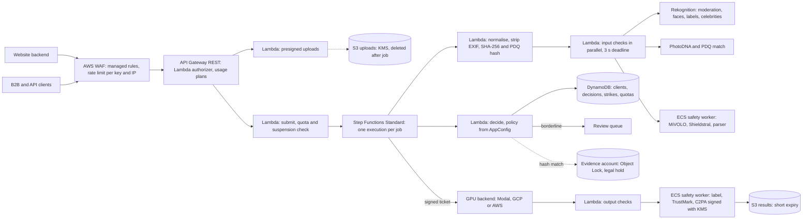

# Safety guardrails for FabricVTON: research and implementation plan

Prepared 29 September 2026. This is engineering research, not legal advice. Have counsel in India, the US, the EU and the UK confirm the legal points before launch.

Status labels used below: **verified** means checked against an official page, model card, licence or paper during this research. **Reported** means it comes from one secondary source. **Unverified** means it still needs checking.

---

## 1. The short version

Today the service will dress anyone in anything. A photo of a child and a lingerie product image go through the same path as an adult and a T-shirt. Nothing in `src/` or `deployment/` checks age, nudity, garment type or consent. The only refusals are "no garment found" and "garment category is ambiguous". The API is protected by one shared bearer token, with no per-customer keys and no rate limits.

That is the exact capability regulators acted against in January 2026, when X's Grok was used to put real women and some minors into bikinis and underwear. India's MeitY gave X 72 hours to act. The EU Commission, Ofcom and the California Attorney General opened investigations. India's IT Amendment Rules 2026, in force since 20 February 2026, now require any service that creates synthetic images to deploy automated tools that prevent child sexual abuse material, non-consensual intimate imagery and obscene content.

The fix is a **guardrail layer on AWS in front of the GPU model**. Every request passes through it. The GPU backend refuses anything the layer has not signed. The layer runs eleven guardrails:

| # | Guardrail | What it stops | Main mechanism | Priority |
|---|---|---|---|---|
| G1 | Minor protection | Try-on of anyone who may be under 18 | Two age estimators with a challenge age of 25; unknown age treated as a possible minor | Launch blocker |
| G2 | Revealing-garment policy | Lingerie, swimwear and sheer garments on people who should not get them | Garment classifier plus a decision matrix of age band by garment class | Launch blocker |
| G3 | Input content screening | Nude or sexual person photos, and "garments" that are really body images | Rekognition moderation plus garment-validity checks | Launch blocker |
| G4 | CSAM hash matching and reporting | Known child sexual abuse material entering the system | PhotoDNA, PDQ hashing, quarantine, report to Indian police and NCMEC | Launch blocker |
| G5 | Output screening | Nudity the model invents, including from adversarial garments | Moderation, nudity detector and an age re-check on the generated image | Launch blocker |
| G6 | Anti-undressing coverage check | Outputs showing much more skin than the garment should | Compare skin area from the human parser before and after | Launch blocker |
| G7 | Real people and consent | Try-on of someone else without consent, and of public figures | Single-person rule, celebrity detection, consent attestation, self-only mode | High |
| G8 | Instruction screening | Text prompts such as "make it see-through" | No free text in v1; later a text policy classifier | Before instructions ship |
| G9 | Provenance and labelling | Outputs passed off as real photos | Visible label, signed C2PA manifest, invisible watermark | High, legal deadline |
| G10 | Access control and abuse enforcement | Anonymous abuse, bypassing the layer, repeat offenders | Per-client API keys, signed GPU tickets, rate limits, strikes, B2B verification | Launch blocker |
| G11 | Privacy, retention, review and takedown | Keeping photos too long, slow takedowns, no audit trail | Auto-delete, audit log without images, review queue, 2-hour takedown process | High |

Sections 5 to 15 explain each guardrail and how to build it. Section 16 is the architecture on AWS. Section 21 is the rollout plan.

---

## 2. Why try-on needs stronger guardrails than most image tools

Try-on is image editing of real people, and its whole job is changing clothes. Three findings from this research make that risky:

1. **Innocent-looking garments can still produce nudity.** A CVPR 2025 paper on hijacking image-prompt adapters crafted garment images that look normal to people and to garment classifiers. They made the IDM-VTON try-on model produce nudity in 56.2% of outputs ([Chen et al., arXiv 2504.05838](https://arxiv.org/abs/2504.05838), verified). So checking inputs is not enough. The output must be checked too.
2. **Guard models follow custom policies poorly.** On a 2026 benchmark that measures whether a safety model changes its verdict when the policy changes, Llama Guard 4 scored 1.6 and ShieldGemma 2 scored 4.5 ([PolicyShiftBench, arXiv 2607.05910](https://arxiv.org/pdf/2607.05910), reported). A rule like "swimwear is fine for adults but never for a possible minor" must be written in your own code, not left to a model.
3. **Age estimation is least accurate exactly where it matters.** Error is highest around ages 13 to 25, is higher for women, and varies by region of birth, including South Asia ([NIST IR 8525](https://www.nist.gov/news-events/news/2024/05/nist-reports-first-results-age-estimation-software-evaluation), verified). Yoti's own figures show about 50% more error for the darkest skin tones among 13 to 17 year olds ([Yoti white paper, July 2025](https://cdn.aws.yoti.com/wp-content/uploads/2026/01/Yoti-Age-Estimation-White-Paper-July-2025-PUBLIC-v1.pdf), verified). Thresholds need a wide safety margin.

---

## 3. What the leading providers do

| Provider | Minors | Revealing garments | Real people | Provenance |
|---|---|---|---|---|
| **Google Shopping try-on** ([help page](https://support.google.com/googleshopping/answer/16253678?hl=en), verified) | Users must be 18 or older. No photos of children | "Lingerie, bathing suits, and accessories aren't supported" | Photo must be "of yourself or one that you have permission to use" | Not stated on the page |
| **Google Vertex AI `virtual-try-on-001`** ([API reference](https://docs.cloud.google.com/gemini-enterprise-agent-platform/reference/rest/Shared.Types/VirtualTryOnModelParams), reported) | `personGeneration` defaults to adults only; a "Child" safety code fires when minors are not allowed | `safetySetting` from block-low to block-only-high; `block-none` is restricted | Celebrity safety codes | Watermark on by default; C2PA supported |
| **Gemini app** ([help](https://support.google.com/gemini/answer/14286560?hl=en), verified) | "Editing images isn't available to users under 18" | Covered by sexual-content filters | Prohibited use policy bans intimate imagery without consent | SynthID on all images; C2PA on Nano Banana Pro |
| **OpenAI image generation** ([system card, March 2025](https://cdn.openai.com/11998be9-5319-4302-bfbf-1167e093f1fb/Native_Image_Generation_System_Card.pdf), verified) | Editing uploaded photorealistic children is not allowed. A classifier labels uploads as no person, adult or child, tuned so borderline cases count as child (child recall 0.97) | Sexual content blocked; stronger safeguards for intimate imagery | Public figures who are minors are blocked; public figures can opt out | C2PA on every image; SynthID added in 2026 |
| **FASHN AI API** ([v1.6 docs](https://docs.fashn.ai/api-reference/tryon-v1-6), verified) | No minor detection parameter; terms require users to be 18+ and exclude content that harms minors | `conservative` blocks underwear, swimwear and revealing outfits; `permissive` (default) blocks only explicit nudity; `none` disables moderation | Terms require consent for identifiable people | Not stated |
| **Amazon Nova Canvas try-on** ([service card](https://docs.aws.amazon.com/ai/responsible-ai/nova-canvas/overview.html), verified) | Child-safety controls cannot be switched off | Input and output moderation | Blocks famous people | Invisible watermark plus C2PA |
| **Black Forest Labs (FLUX)** ([FLUX.2 dev card](https://huggingface.co/black-forest-labs/FLUX.2-dev), verified) | CSAM filters on the API cannot be removed; training data filtered with the Internet Watch Foundation (IWF) | NSFW filters shipped with the open weights, which the licence requires | Safety tuning against turning uploads into intimate imagery | C2PA on API output |
| **X / Grok after January 2026** ([PBS/AP](https://www.pbs.org/newshour/world/grok-blocked-from-undressing-images-with-ai-in-places-where-its-illegal-x-says), reported) | Added after the scandal | Stopped editing real people into bikinis and underwear | Real people are the restriction trigger | Not stated |

**Patterns that recur:**
- Adults only, and the uploaded person is checked for minors, not only the account holder.
- Lingerie and swimwear are off by default for consumers.
- Checks run on the inputs, on the input and instruction together, and on the output.
- CSAM and non-consensual intimate imagery protections cannot be lowered by customers. Looser tiers need approval.
- Uploads are hash-matched and hits are reported to NCMEC.
- Every output is labelled, with C2PA plus an invisible watermark.

Thorn's "Safety by Design for Generative AI" principles, signed by Google, OpenAI, Meta, Microsoft, Amazon, Anthropic, Stability AI and others, commit to the same set of measures ([Thorn](https://www.thorn.org/blog/generative-ai-principles/), verified):
- detect abusive content in inputs and outputs;
- include provenance by default;
- let users report abuse;
- enforce against violators;
- remove "nudifying" services for images of children.

---

## 4. Legal drivers

| Requirement | Where it comes from | Guardrail |
|---|---|---|
| Automated tools must prevent synthetic CSAM, non-consensual intimate imagery and obscene content | India IT Amendment Rules 2026, rule 3(3)(a)(i), in force 20 Feb 2026 ([Khaitan](https://www.khaitanco.com/thought-leadership/MeitY-notifies-the-IT-Amendment-Rules-2026), verified) | G1 to G6 |
| Prominent visible label on synthetic images; permanent metadata or identifier where feasible; users must not be able to remove them | Same rules, rule 3(3)(a)(ii) and 3(3)(b) | G9 |
| Remove nudity and morphed-image complaints within **2 hours**; court or government orders within **3 hours** | Same rules, rule 3(2)(b) and 3(1)(d) | G11 |
| AI-edited sexual images of real or apparent children are child sexual abuse material; possession and failure to report are offences | POCSO Act s.2(1)(da), s.15, s.19 to 21; IT Act s.67B; Supreme Court, *Just Rights for Children Alliance v S. Harish* (2024) | G1, G4 |
| Children are under 18; verifiable parental consent; no tracking of children | DPDP Act s.9 and DPDP Rules 2025, most obligations from 13 May 2027 | G1, G11 |
| Report apparent CSAM to NCMEC and preserve it for 1 year | 18 U.S.C. 2258A and the REPORT Act (2024) | G4 |
| Remove non-consensual intimate images within 48 hours of a request | US TAKE IT DOWN Act; FTC enforcement began 19 May 2026 ([FTC](https://www.ftc.gov/news-events/news/press-releases/2026/05/ftc-begins-enforcing-take-it-down-act), verified) | G11 |
| Machine-readable marking of AI output | EU AI Act Art. 50(2), applies from 2 Aug 2026, with a grace period to 2 Dec 2026 for systems already on the market ([EC FAQ](https://digital-strategy.ec.europa.eu/en/faqs/transparency-obligations-under-article-50-ai-act), verified) | G9 |
| New EU ban on systems that can produce intimate images of identifiable people or CSAM without reasonable and adequate safeguards | EU AI Act prohibited practices added by the Digital Omnibus, from 2 Dec 2026 (reported; exact article numbering unverified) | G1 to G6, G10 |
| Offence of supplying "nudification tools", with a defence of taking all reasonable steps to prevent misuse | UK Crime and Policing Act 2026, in force 29 Jun 2026 ([gov.uk](https://www.gov.uk/government/collections/crime-and-policing-act-2026), verified) | All, documented |

A documented, tested guardrail layer is also the legal defence in the UK and the EU. Keep evidence that each guardrail works (section 19).

---

## 5. G1: Minor protection

**Rule.** No try-on of anyone who may be under 18, with any garment, in any mode. This rule cannot be switched off by a client.

**Why a buffer.** Age estimators are off by several years around the teenage range. The UK regulator Ofcom tells estimation-based systems to use a "challenge age", with 25 as its example for an 18 threshold ([Ofcom guidance §4.16 to 4.19](https://www.ofcom.org.uk/siteassets/resources/documents/consultations/category-1-10-weeks/statement-age-assurance-and-childrens-access/part-3-guidance-on-highly-effective-age-assurance.pdf), verified). Your photos are uncontrolled: full-body shots, small faces and varied lighting. So the buffer must be at least as wide.

**Age bands.** Every person photo gets one of four bands:

| Band | Condition | Meaning |
|---|---|---|
| `minor` | Any estimator says under 18, or Rekognition `AgeRange.Low` is under 16 | Block everything |
| `challenge` | Both estimators are 18 or older, but either is under 25 | Standard garments only |
| `adult` | Both estimators are 25 or older | Full policy applies |
| `unknown` | No usable face (back view, face under about 80 px, heavy occlusion) | Treated like `challenge`; the consumer site asks for a clear front-facing photo |

**Implementation.**
1. **First estimator: Amazon Rekognition `DetectFaces`** with `Attributes=["ALL"]`. It returns an `AgeRange` with a low and a high value. AWS says the midpoint is the best single estimate and recommends high confidence thresholds for sensitive uses ([AWS guidance](https://docs.aws.amazon.com/rekognition/latest/dg/guidance-face-attributes.html), verified). Use both: the midpoint for the band, and a low value under 16 as a hard trigger. Cost is $0.001 per image.
2. **Second estimator: MiVOLO v2**, self-hosted, Apache-2.0 ([model card](https://huggingface.co/iitolstykh/mivolo_v2), verified). It uses face and body crops, so it still gives a signal when the face is small. Run it on the person crop your pipeline already makes in `cropping.py`.
3. **Take the minimum** of the two estimates. Disagreement of more than 8 years between them means `unknown`.
4. **Re-run on the output** (G5). The model can change a face.

**Models to avoid.**
- InsightFace's age weights are licensed for non-commercial research only.
- Azure Face age is restricted to managed customers.
- Commercial age-assurance APIs such as Yoti are the most accurate, but they are designed for live selfies with liveness checks, not arbitrary full-body photos. Use one later for the consumer account 18+ check, not for the photo check.

**Test it before trusting it.** Build a consented test set of Indian adults aged 18 to 30 and of clothed children. Children's images need parental consent, or a licensed dataset. Measure how often each skin-tone group and gender is wrongly banded, and widen the buffer if any group falls short. Never create or collect sexualised images of minors for testing, even synthetic ones.

---

## 6. G2: Revealing-garment policy

**Rule.** A decision matrix of the person's age band against the garment's class. The dangerous case is a combination, such as a possible minor with swimwear. Neither input alone reveals it.

**Garment classes.**
- `standard`: tops, bottoms, dresses, ethnic wear, outerwear.
- `revealing`: lingerie, underwear, swimwear, sheer or see-through garments, bodysuits, very short garments.
- `invalid`: not a real garment, for example a skin-coloured image, a nude body or an adversarial pattern (G3).

**How to classify the garment.** Use three signals and take the most restrictive:
1. **Client metadata.** B2B catalogues already know their product category. Require it in the API (`garment_category`), and map the client's taxonomy to your classes once per client.
2. **Rekognition `DetectModerationLabels`** on the garment image. Its "Swimwear or Underwear" category (with female and male sub-labels) catches lingerie, bikinis and underwear. Explicit labels such as "Obstructed Intimate Parts" catch sheer items with visible body parts ([taxonomy](https://docs.aws.amazon.com/rekognition/latest/dg/moderation-api.html), verified).
3. **Shieldstral-1.0-3B**, Mistral's policy-driven safety classifier. It is Apache-2.0 and takes images, and you give it plain-language yes/no questions ([model card](https://huggingface.co/mistralai/Shieldstral-1.0-3B), verified). Ask it three questions: "Is this garment lingerie or underwear?", "Is this garment swimwear?", "Is this garment sheer or see-through?" It returns a score from 0 to 1 for each.

Cache the verdict by the garment image's hash, since catalogues reuse garments.

**Decision matrix.**

| Age band | `standard` garment | `revealing` garment | `invalid` garment |
|---|---|---|---|
| `minor` | Block | Block, and flag as a child-safety event (G4 procedure) | Block, child-safety event |
| `challenge` | Allow | Block | Block |
| `unknown` | Allow in B2B mode; consumer mode asks for a front-facing photo | Block | Block |
| `adult` | Allow | Consumer: block by default, like Google. B2B catalogue: allow, with strict output checks (G5, G6) | Block |

Ethnic wear needs care. Blouses, cholis and backless designs show skin by design. Do not use Rekognition's "Bare Back" sub-label as a block signal. Measure false blocks on your own catalogue before fixing thresholds.

---

## 7. G3: Input content screening

**Rule.** Reject person photos that already contain nudity or sexual content. Reject "garments" that are not garments.

**Implementation.**
1. **Person photo:** Rekognition `DetectModerationLabels`, taxonomy v7.
   - Block on "Explicit" and "Non-Explicit Nudity of Intimate parts and Kissing", with a minimum confidence around 50 to 60.
   - "Swimwear or Underwear" on the person photo is allowed only for `adult` in B2B mode. Elsewhere, ask for a photo in regular clothing.
2. **Single person.** Count faces from `DetectFaces` and people from `DetectLabels` (Person instances, which catches people facing away). More than one person means block or ask for a single-person photo. This stops "put the person on the left into lingerie" attacks on group photos.
3. **Garment validity.**
   - Your two category detectors must already agree (existing code in `category.py`).
   - Add: moderation labels on the garment image must be clean.
   - Add: the garment mask must cover a reasonable share of the image.
   - Add: the garment photo must not show a nude or partly nude body.

This is the cheapest guardrail and removes most blatant misuse.

---

## 8. G4: CSAM hash matching and reporting

**Rule.** Every uploaded image is checked against lists of known child sexual abuse material before anything else happens. A match stops the request, preserves the evidence and triggers reporting.

**Tools.**

| Tool | What it does | Access |
|---|---|---|
| [Microsoft PhotoDNA Cloud Service](https://www.microsoft.com/en-us/photodna/faq) | Matches known CSAM hashes over a REST API | Free after vetting. **Apply now**, since vetting takes time (verified) |
| [Google Content Safety API](https://protectingchildren.google/tools-for-partners/) | Classifier that ranks likely new CSAM | Free, by application (verified) |
| [Meta PDQ and Hasher-Matcher-Actioner](https://github.com/facebook/ThreatExchange/tree/main/hasher-matcher-actioner) | Open-source perceptual hashing, with an AWS reference deployment | Free; needs hash lists (IWF membership, or NCMEC lists for eligible companies) |
| [Thorn Safer Essential](https://aws.amazon.com/marketplace/pp/prodview-dfwekn4bx4ake) | Hash matching against known-CSAM lists | $30,720 a year for 1M queries a month (verified) |

Amazon Rekognition and Bedrock Guardrails do **not** detect CSAM, and AWS says so ([Rekognition docs](https://docs.aws.amazon.com/rekognition/latest/dg/moderation-api.html), verified).

**Procedure on a hash match.**
1. Block the request, suspend the account and API key immediately, and show a neutral error.
2. Move the image to an **evidence store in a separate AWS account**: S3 with Object Lock in governance mode plus a legal hold, a KMS key owned by that account, and access only through a break-glass role with MFA. It never enters the review tool, the GPU path or any other classifier.
3. Report in India to the National Cybercrime Reporting Portal ([cybercrime.gov.in](https://cybercrime.gov.in)) or the Special Juvenile Police Unit, as POCSO rule 11 requires.
4. Report to the NCMEC CyberTipline for US users, after registering as a reporting service at [esp.ncmec.org](https://esp.ncmec.org/registration).
5. Preserve for at least one year (US REPORT Act) and 180 days (India IT Rules). Counsel should set the final period.

**Classifier-only suspicions** are different: a possible minor with nudity or a revealing garment, but no hash match. Block, do not store the image, record hashes and scores, and escalate the account to the trust and safety lead. The Supreme Court held in 2024 that viewing such material can be possession, so staff should not open these images. Counsel should write this procedure.

**Never** build a CSAM training set, generate synthetic CSAM for testing, or scrape unvetted image sets for training. Hash-scan any training data you collect for your own model.

---

## 9. G5: Output screening

**Rule.** The generated image is checked before anyone sees it. If a check fails, the output is deleted and never returned.

**Implementation.**
1. **Rekognition `DetectModerationLabels` on the output**, with lower thresholds than for inputs (around 30 to 40 for Explicit). For revealing garments, block "Explicit" and "Obstructed Intimate Parts".
2. **Nudity detector with body-part locations.** [NudeNet](https://github.com/notAI-tech/NudeNet) returns boxes for exposed and covered body parts. Check its licence first: GitHub says AGPL-3.0 and it is built on Ultralytics YOLO, which is also AGPL. If the licence does not work for you, use Rekognition's Explicit and Non-Explicit Nudity labels, plus [Marqo nsfw-image-detection-384](https://huggingface.co/Marqo/nsfw-image-detection-384) (Apache-2.0) as a fast second opinion.
3. **Age re-check** with the G1 estimators. If the output looks younger than the input band allows, block.
4. **Policy classifier as a final check.** Shieldstral with the question "Does this image show a person in a sexualised or revealing way?", scored on the output.

---

## 10. G6: Anti-undressing coverage check

This guardrail is specific to try-on and uses what your pipeline already computes.

**Rule.** The output must not show more skin than the garment accounts for. Adversarial garments and model errors both show up as unexplained extra skin.

**Implementation.**
1. Your pipeline already runs the FASHN human parser, which labels body regions (`arms`, `torso`, `legs`) and garment regions (`top`, `dress`, `skirt`, `pants`). Run it on the input person photo and on the output.
2. Compute the exposed-skin share of the torso and hip region in both images.
3. Compare it with the expected coverage for the garment's category and class. A standard top should cover the torso. A dress should cover torso and hips.
4. If the output's exposed torso or hip skin is larger than the input's by more than a calibrated margin, block, whatever the moderation labels say. Start with a margin around 15% of the region's area, and tune it on your evaluation manifest.

The human parser currently carries non-commercial terms (see `docs/what-is-built.md`). The same check works with any permissively licensed human parser or skin segmenter, so plan it with the parser replacement.

---

## 11. G7: Real people and consent

**Rule.** People can only be dressed with their consent. Public figures are blocked unless a client has a contract with them.

**Implementation by mode.**
- **Consumer website: self try-on.**
  - The account holder must be 18 or older.
  - They confirm the photo is of themselves, or that they have the person's permission, at each upload (the rules Google uses).
  - Later: an optional selfie match between the account's verified selfie and the uploaded photo. Process the face comparison transiently and store no face template. Face templates are biometric data under GDPR and Illinois BIPA, and BIPA class actions have already targeted try-on tools.
- **B2B catalogue mode.** The client contractually attests that its model photos come from adults who consented to AI editing. Keep the signed attestation on file.
- **Third-party API clients serving end users.** Treat them as consumer mode unless they complete B2B verification. They must pass a stable end-user ID with each request, so enforcement can target the abusive user rather than the whole client.

**Public figures.** Amazon Rekognition `RecognizeCelebrities` ($0.001 per image) on the person photo. Block matches above about 90 confidence, unless the celebrity's ID is on the client's allow-list, for example a contracted brand ambassador. Test coverage of Indian public figures before relying on it.

---

## 12. G8: Instruction screening

The current model takes no text. The planned Qwen-Image-Edit model takes instructions, which opens a new attack surface: "make the fabric transparent", "remove the top".

**Rule for v1 of instruction support.** No free text. Offer a fixed menu of instructions, such as drape style, sleeve tucked or untucked, or dupatta placement, and map each to a prompt template on the server.

**If free text is added later**, screen it with a text policy classifier:
- [OpenAI gpt-oss-safeguard-20b](https://huggingface.co/openai/gpt-oss-safeguard-20b) (Apache-2.0, text only, verified), with a written policy on clothing removal, transparency and sexualisation.
- Or Amazon Bedrock Guardrails with a denied topic and prompt-attack detection.

Then check the image and instruction together with Shieldstral, which accepts both.

**About the classifier you mentioned.** No released model matches the name as transcribed. The closest match is OpenAI's **gpt-oss-safeguard-20b**: "safeguard" sounds like "Ceph", "20b" like "200x", and "GPT" like "Z J-E-V". It is a strong policy classifier, but it reads **text only** and cannot look at a photo. It belongs in G8, not in G1 to G6. The best open classifier that reads images against your own policy is **Shieldstral-1.0-3B** (Apache-2.0, released mid-2026). NVIDIA's **Nemotron-3.5-Content-Safety** (4B) is an alternative. Avoid **Llama Guard 4** for this: Meta says it is not designed for image-only classification or for AI-generated images.

---

## 13. G9: Provenance and labelling

**Rule.** Every output carries three marks, and no API flag turns them off:

1. **A visible "AI-generated" label.** India's rules require a prominent label on synthetic images. Render it into the image by default. B2B clients may choose its position and style, but not remove it.
2. **A signed C2PA manifest** using [c2pa-python](https://github.com/contentauth/c2pa-python) (MIT or Apache-2.0, verified). Sign with a certificate from a certificate authority on the C2PA Trust List. Keep the signing key in AWS KMS. Record the output ID, the model version and the policy version.
3. **An invisible watermark** carrying the output ID:
   - [Adobe TrustMark](https://github.com/adobe/trustmark) (MIT, with a C2PA soft-binding example), or
   - Meta's [PixelSeal / Video Seal](https://github.com/facebookresearch/videoseal) (MIT).

   Metadata is stripped when images are re-uploaded, and the watermark survives that. Watermarks can be removed by determined attackers, so treat them as a label, not a security control.

Add a free verification endpoint, `GET /v1/verify`, that reads the watermark or manifest and confirms whether FabricVTON made an image. This is the EU Code of Practice expectation.

---

## 14. G10: Access control and abuse enforcement

**Rule.** No anonymous access, no path to the GPU that skips the layer, and escalating consequences for abuse.

**Implementation.**
1. **Per-client API keys**, stored as hashes in DynamoDB. The single shared worker token becomes an internal secret between the layer and the GPU backend only.
2. **Signed GPU tickets.** The layer signs every allowed job with a KMS-held ES256 key. The ticket contains:
   - the job ID, client ID and policy version;
   - the SHA-256 of both normalised images;
   - an expiry of 2 minutes or less.

   The GPU backend verifies the signature with the public key, recomputes the image hashes, rejects reused job IDs, and rejects inline images. On Modal, remove the public web endpoint and call the function with `modal.Function.from_name(...).spawn()` using a token kept in Secrets Manager. Reconcile GPU invocations against allowed decisions every day, and alert on any difference.
3. **Rate limits.**
   - AWS WAF rate-based rules keyed on the API key header and on IP address.
   - API Gateway usage plans for coarse limits.
   - Exact GPU quotas in DynamoDB, because AWS says usage plans are best-effort.
4. **Strikes.** Each blocked request adds a strike to the end user and to the client. Five strikes in 30 days suspends the end user. A child-safety event suspends immediately. Alert when a client's block rate jumps.
5. **B2B verification.** Before issuing production keys:
   - company verification;
   - a signed acceptable-use policy;
   - the adult-model attestation (G7);
   - a named safety contact.
6. **Consumer accounts.**
   - Sign-up is 18+ with a date of birth and terms acceptance.
   - Prohibited-use notices appear at sign-up and upload, and are re-sent every 3 months (India IT Rules 3(1)(c)).
   - Later, a proper age check for accounts.

---

## 15. G11: Privacy, retention, review and takedown

**Retention.**
- Delete uploaded photos when the job finishes, with a 1-day S3 lifecycle rule as a backstop.
- Keep outputs for 1 to 7 days, configurable per client.
- Keep only hashes and decision logs for longer: one year under DPDP rule 8(3) and 180 days under CERT-In. Counsel should confirm how this interacts with deleting the images themselves.
- No training on user photos without a separate opt-in.
- **Before sending any photo to Rekognition, apply an AWS Organizations AI services opt-out policy.** Otherwise AWS may store and use the content to improve its services ([AWS docs](https://docs.aws.amazon.com/organizations/latest/userguide/orgs_manage_policies_ai-opt-out.html), verified).

**Audit log.** One record per request, with no image bytes, face crops, keys or presigned URLs. It contains:
- job ID, client ID and hashed end-user ID;
- mode, policy version and each checker's labels, scores, latency and model version;
- the verdict and its reasons;
- the output hash, watermark ID and C2PA manifest ID.

This record is your evidence that the guardrails work.

**Human review queue.** Borderline cases wait on a queue with a 24-hour limit and are blocked if nobody decides. Amazon Augmented AI (A2I) closed to new customers in July 2026, so build a small internal tool, or use ROOST's open-source [Coop](https://github.com/roostorg/coop) review dashboard. Images are blurred by default. Suspected CSAM never enters this queue.

**Takedown.**
- A public report form, open to people without accounts, for "an image of me was made without consent".
- Target removal within 2 hours to meet India's rule. The US and UK allow 48 hours.
- Use the output's perceptual hash to find and remove copies, and block re-generation from the same inputs.
- Publish a Grievance Officer who acknowledges complaints within 24 hours.
- Run a 24/7 intake for court and government orders, with a 3-hour target.

---

## 16. The guardrail layer on AWS

### 16.1 Why the API must become asynchronous

A try-on takes 27 to 60 seconds on an L4. API Gateway REST integrations time out at 29 seconds by default. So the API becomes a job API:
- `POST /v1/uploads` returns presigned upload URLs.
- `POST /v1/tryons` returns `202` with a job ID.
- The client polls `GET /v1/tryons/{id}` or receives a signed webhook.

Images go straight to S3, never through API Gateway's 10 MB payload limit.

### 16.2 Architecture



### 16.3 Components

| Component | AWS service | Notes |
|---|---|---|
| Edge protection | AWS WAF | Rate-based rule on the `x-api-key` header and on IP. Bot Control only on website routes, because B2B traffic is automated by design |
| API | API Gateway **REST** API | REST, not HTTP API, because it supports API keys, usage plans, per-client throttling and WAF |
| Authentication | Lambda authorizer plus DynamoDB | Checks the key hash and suspension status, and returns the usage-plan key |
| Uploads | S3 presigned POST | Size and type limits in the policy; 5-minute expiry |
| Workflow | Step Functions **Standard** | Needed to wait on the GPU and on reviews. Express workflows cannot wait for callbacks |
| Fast checks | Lambda | Calls Rekognition and the hash service in parallel threads |
| Model checks | ECS on EC2 with a small GPU (one g6.xlarge with an L4 fits MiVOLO, Shieldstral and the parser), or CPU Fargate if you start without Shieldstral | Keep warm; these models cold-start badly |
| Policy | AWS AppConfig | Versioned YAML with a schema, staged rollout, rollback |
| State | DynamoDB on demand | Clients, decisions (with TTL), strikes, quotas |
| Keys | KMS | Data keys, an ES256 key for GPU tickets, and a key for C2PA signing |
| Secrets | Secrets Manager | Modal token, worker tokens, PhotoDNA key, with rotation |
| Audit | CloudWatch Logs plus Firehose to S3 | Decision records only, no images |
| Evidence | Separate AWS account | S3 Object Lock governance mode with legal hold |

The layer does not care where the GPU runs. It works the same whether the model stays on Modal, runs on the GCP worker, or moves to AWS GPUs later. If the GPU is on AWS, put it in private subnets with no public IP and allow traffic only from the layer.

### 16.4 Request flow

1. **Authenticate.** The client authenticates, and the authorizer checks the key, suspension status and quota.
2. **Upload.** The client uploads both images to presigned URLs.
3. **Normalise.** Decode HEIC and WebP to JPEG, strip EXIF and GPS data, resize to at most 2048 px, then hash. All later checks and the GPU use these exact bytes.
4. **Input checks** run in parallel with a 3-second deadline:
   - G4 hash match;
   - G3 moderation and people count;
   - G1 two age estimators;
   - G7 celebrity check;
   - G2 garment class.
5. **Decide.** The decision function applies the policy and writes the audit record. It returns ALLOW, REVIEW or BLOCK.
6. **Generate.** An allowed job gets a signed ticket and goes to the GPU. The GPU writes its output to a staging location.
7. **Output checks.** G5 and G6 run on the output. A failure deletes it.
8. **Mark.** G9 adds the label, watermark and C2PA manifest.
9. **Deliver.** The client gets a short-lived download URL, and the uploads are deleted.

### 16.5 Fail closed

- A required checker that errors or times out gets one retry within the deadline. The job is then blocked with `checker_unavailable` and a retryable 503. It does not count as a strike.
- If Rekognition's error rate crosses a threshold, stop admitting jobs rather than letting them through.
- A failed output check means nothing is returned.
- A review that times out is blocked.

---

## 17. Policy as configuration

Keep rules in a versioned file, not scattered through code. Every decision records the version it used, so old decisions can be replayed against new rules.

```yaml
version: "2026-09-29.1"
on_checker_failure: block
deadlines_ms: {input: 3000, output: 3000}
non_overridable: [csam_hash_match, minor, minor_with_revealing]

age:
  challenge_age: 25
  hard_minor_low: 16          # Rekognition AgeRange.Low under this means minor
  max_estimator_gap: 8        # larger disagreement means unknown
  min_face_px: 80

modes:
  consumer:
    require_face: true
    max_people: 1
    celebrity: {min_confidence: 90, action: block}
    garment_matrix:
      minor:     {standard: block, revealing: block_child_safety, invalid: block_child_safety}
      challenge: {standard: allow, revealing: block, invalid: block}
      unknown:   {standard: ask_new_photo, revealing: block, invalid: block}
      adult:     {standard: allow, revealing: block, invalid: block}
    input_moderation:
      - {label: "Explicit", min_conf: 50, action: block}
      - {label: "Non-Explicit Nudity of Intimate parts and Kissing", min_conf: 60, action: block}
      - {label: "Swimwear or Underwear", min_conf: 70, action: ask_new_photo}
    output_moderation:
      - {label: "Explicit", min_conf: 30, action: block}
      - {label: "Non-Explicit Nudity of Intimate parts and Kissing", min_conf: 40, action: block}
    skin_gain_limit: 0.15
  b2b_catalogue:
    require_face: false
    max_people: 1
    celebrity: {min_confidence: 90, action: block, allow_list_from_client: true}
    garment_matrix:
      minor:     {standard: block, revealing: block_child_safety, invalid: block_child_safety}
      challenge: {standard: allow, revealing: block, invalid: block}
      unknown:   {standard: allow, revealing: block, invalid: block}
      adult:     {standard: allow, revealing: allow_strict, invalid: block}
    output_moderation:
      - {label: "Explicit", min_conf: 30, action: block}
    skin_gain_limit: 0.15

enforcement:
  strikes_to_suspend: 5
  strike_window_days: 30
  immediate_suspend_on: [csam_hash_match, block_child_safety]
```

Client settings may choose a mode and adjust thresholds only within limits the schema allows. Nothing can switch off the entries in `non_overridable`. Test each new version in shadow mode on live traffic, logging only, before it starts blocking.

---

## 18. The decision function

A pure function with no network calls, so it can be unit-tested and replayed from the audit log.

```python
from dataclasses import dataclass, field

RANK = {"allow": 0, "allow_strict": 1, "ask_new_photo": 2, "review": 3, "block": 4, "block_child_safety": 5}


@dataclass
class Verdict:
    action: str = "allow"
    reasons: list = field(default_factory=list)

    def escalate(self, action: str, reason: str) -> None:
        self.reasons.append(reason)
        if RANK[action] > RANK[self.action]:
            self.action = action


def age_band(faces: list, mivolo_age: float | None, cfg: dict) -> str:
    usable = [f for f in faces if f["width_px"] >= cfg["min_face_px"] and f["confidence"] >= 90]
    if not usable and mivolo_age is None:
        return "unknown"
    estimates = [(f["age_low"] + f["age_high"]) / 2 for f in usable]
    if mivolo_age is not None:
        estimates.append(mivolo_age)
    if any(f["age_low"] < cfg["hard_minor_low"] for f in usable) or min(estimates) < 18:
        return "minor"
    if max(estimates) - min(estimates) > cfg["max_estimator_gap"]:
        return "unknown"
    return "challenge" if min(estimates) < cfg["challenge_age"] else "adult"


def decide_input(checks: dict, policy: dict, client: dict) -> Verdict:
    v = Verdict()
    if checks["hash"]["match"]:
        v.escalate("block_child_safety", "csam_hash_match")
        return v
    for name in ("hash", "moderation", "faces", "people", "garment", "age_model"):
        if checks[name]["status"] != "ok":
            v.escalate("block", f"checker_unavailable:{name}")   # fail closed, no strike
    if v.action == "block":
        return v

    mode = policy["modes"][client["mode"]]
    for label in checks["moderation"]["labels"]:
        for rule in mode.get("input_moderation", []):
            if label["name"] == rule["label"] and label["confidence"] >= rule["min_conf"]:
                v.escalate(rule["action"], f"input:{label['name']}")

    if checks["people"]["count"] > mode["max_people"]:
        v.escalate("block", "more_than_one_person")

    band = age_band(checks["faces"]["faces"], checks["age_model"]["age"], policy["age"])
    if band == "unknown" and mode["require_face"]:
        v.escalate("ask_new_photo", "no_usable_face")
    garment = checks["garment"]["class"]                        # standard / revealing / invalid
    v.escalate(mode["garment_matrix"][band][garment], f"matrix:{band}:{garment}")

    for celeb in checks["celebrities"]["matches"]:
        allowed = mode["celebrity"].get("allow_list_from_client") and celeb["id"] in client.get("celebrity_allow", [])
        if celeb["confidence"] >= mode["celebrity"]["min_confidence"] and not allowed:
            v.escalate(mode["celebrity"]["action"], f"public_figure:{celeb['id']}")
    return v


def decide_output(checks: dict, input_band: str, policy: dict, client: dict) -> Verdict:
    v = Verdict()
    mode = policy["modes"][client["mode"]]
    for label in checks["moderation"]["labels"]:
        for rule in mode["output_moderation"]:
            if label["name"] == rule["label"] and label["confidence"] >= rule["min_conf"]:
                v.escalate(rule["action"], f"output:{label['name']}")
    if checks["skin"]["torso_hip_gain"] > mode["skin_gain_limit"]:
        v.escalate("block", "skin_gain")
    out_band = age_band(checks["faces"]["faces"], checks["age_model"]["age"], policy["age"])
    if out_band == "minor" or (out_band == "challenge" and input_band == "adult" and checks["garment_class"] == "revealing"):
        v.escalate("block", f"output_age:{out_band}")
    return v
```

---

## 19. Testing the guardrails

A guardrail you have not measured is not a defence. Build three test sets, all from consenting people:

1. **Adults in Indian ethnic wear, Western wear, swimwear and lingerie product shots**, across Monk Skin Tone groups and body shapes. This measures false blocks, which cost you customers.
2. **Clothed children and young adults aged 16 to 30**, with parental consent for minors or from a licensed dataset. This measures the age bands. Never put minors in revealing garments, even to test.
3. **Attack cases**: group photos, back views, low-resolution faces, heavily edited photos, skin-coloured "garments", and the adversarial-garment method from the CVPR 2025 paper, run against your own model.

**Metrics.**
- For every guardrail, report the miss rate and the false-block rate, broken down by skin tone and gender.
- The acceptance bar for G1 is a near-zero miss rate for under-18s, even at the cost of more false blocks for young adults.
- Re-run the suite on every policy change and every model change, and keep the results. They are your evidence of "reasonable steps".

---

## 20. Cost and latency

At first-tier us-east-1 list prices per try-on. Mumbai prices may differ.

| Item | Calls | Cost |
|---|---|---|
| Rekognition on the person photo: moderation, faces, labels, celebrities | 4 | $0.004 |
| Rekognition on the garment photo (cached by hash) | 1 | up to $0.001 |
| Rekognition on the output: moderation, faces | 2 | $0.002 |
| PhotoDNA | 2 | $0 once approved |
| Self-hosted models on one g6.xlarge | shared | about $0.001 to $0.003 at moderate volume (estimate) |
| API Gateway, Lambda, Step Functions, DynamoDB, KMS | about 20 | under $0.001 |
| **Total guardrails** | | **about $0.008 to $0.010** |

This compares with about $0.019 of GPU cost per try-on on a warm L4 (your measurement). Guardrails add roughly 5% to latency: about 1 to 2 seconds against 27 to 60 seconds of generation.

**Reducing cost:**
- cache garment verdicts;
- drop `DetectLabels` once the self-hosted detector counts people;
- run the output age check only when the input band was `challenge` or the garment is revealing.

Rekognition's default limit outside the main US and EU regions is 5 requests per second per API, so request a quota increase before launch.

---

## 21. Rollout plan

**This week, before any wider launch:**
1. Apply the AWS AI services opt-out policy.
2. Disable revealing garments everywhere. This is FASHN's `conservative` behaviour and Google's policy.
3. Add Rekognition `DetectFaces` and `DetectModerationLabels` to the current request path as a stopgap, blocking any possible minor and any nudity.
4. Replace the shared token with per-client keys.
5. Apply for PhotoDNA and the Google Content Safety API, and register with NCMEC.
6. Update the terms of service and acceptable-use policy: 18+, consent, prohibited uses, enforcement and reporting.

**Weeks 2 to 4: the layer, version 1.**
- API Gateway, WAF, the async job API and Step Functions.
- G1 with Rekognition plus MiVOLO.
- G2 with metadata, Rekognition and Shieldstral.
- G3, G5, G6 and G7.
- Signed GPU tickets, with the public GPU endpoint removed.
- Policy in AppConfig, the audit log, and fail-closed behaviour.
- The visible label and C2PA.

**Weeks 5 to 8.**
- PhotoDNA and PDQ matching, and the evidence account.
- The review queue, strikes and suspension.
- The takedown form and Grievance Officer process.
- TrustMark watermark and the verify endpoint.
- The B2B verification process.
- The three test sets and a per-skin-tone report.

**Before instruction support ships.** G8: a fixed instruction menu, text screening and joint image-and-text checks.

**For FabricVTON's own model**, from the research programme:
- Hash-scan all training data.
- Keep images of children out of any training set that contains revealing garments.
- Red-team the fine-tuned model with the attack set before release.
- Publish a child-safety section in the model card, following the Safety by Design "Develop" commitments.

**Before 2 December 2026.** Machine-readable marking must be in place for EU users. The EU ban on unsafeguarded intimate-image generators also takes effect then.

---

## 22. Open questions for counsel

1. Does a try-on output count as "synthetically generated information" under India's 2026 rules, or fall under the routine-editing exclusion? (Assume it counts.)
2. Can FabricVTON rely on section 79 safe harbour for its own outputs? (Assume not.)
3. What is the exact procedure for classifier-only child-safety suspicions, given that viewing can count as possession?
4. How do DPDP rule 8(3) one-year log retention and early image deletion fit together?
5. Do US 2258A reporting duties apply to an Indian provider serving US users?
6. Does a lingerie render of a non-consenting adult fall within the UK "intimate image" definitions?
7. What are the exact article numbers and scope of the new EU AI Act bans?

---

## 23. Sources

**Provider policies**
- [Google Shopping try-on help](https://support.google.com/googleshopping/answer/16253678?hl=en)
- [Vertex AI virtual try-on parameters](https://docs.cloud.google.com/gemini-enterprise-agent-platform/reference/rest/Shared.Types/VirtualTryOnModelParams)
- [Gemini image help](https://support.google.com/gemini/answer/14286560?hl=en)
- [OpenAI native image generation system card](https://cdn.openai.com/11998be9-5319-4302-bfbf-1167e093f1fb/Native_Image_Generation_System_Card.pdf)
- [FASHN v1.6 API](https://docs.fashn.ai/api-reference/tryon-v1-6)
- [FASHN terms of service](https://fashn.ai/legal/terms-of-service)
- [Amazon Nova Canvas service card](https://docs.aws.amazon.com/ai/responsible-ai/nova-canvas/overview.html)
- [FLUX.2 dev model card](https://huggingface.co/black-forest-labs/FLUX.2-dev)
- [Thorn Safety by Design principles](https://www.thorn.org/blog/generative-ai-principles/)
- [NCMEC on generative AI](https://www.missingkids.org/theissues/generative-ai)

**Classifiers and tools**
- [Shieldstral-1.0-3B](https://huggingface.co/mistralai/Shieldstral-1.0-3B)
- [gpt-oss-safeguard-20b](https://huggingface.co/openai/gpt-oss-safeguard-20b)
- [Nemotron-3.5-Content-Safety](https://huggingface.co/nvidia/Nemotron-3.5-Content-Safety)
- [Llama Guard 4 documentation](https://dev.meta.ai/llama/docs/model-cards-and-prompt-formats/llama-guard-4/)
- [MiVOLO v2](https://huggingface.co/iitolstykh/mivolo_v2)
- [NudeNet](https://github.com/notAI-tech/NudeNet)
- [Marqo NSFW detector](https://huggingface.co/Marqo/nsfw-image-detection-384)
- [Rekognition moderation taxonomy](https://docs.aws.amazon.com/rekognition/latest/dg/moderation-api.html)
- [Rekognition face attribute guidance](https://docs.aws.amazon.com/rekognition/latest/dg/guidance-face-attributes.html)
- [Bedrock Guardrails image filters](https://docs.aws.amazon.com/bedrock/latest/userguide/guardrails-mmfilter.html)
- [PhotoDNA](https://www.microsoft.com/en-us/photodna/faq)
- [Google Content Safety API](https://protectingchildren.google/tools-for-partners/)
- [Meta Hasher-Matcher-Actioner](https://github.com/facebook/ThreatExchange/tree/main/hasher-matcher-actioner)
- [Thorn Safer on AWS Marketplace](https://aws.amazon.com/marketplace/pp/prodview-dfwekn4bx4ake)
- [c2pa-python](https://github.com/contentauth/c2pa-python)
- [Adobe TrustMark](https://github.com/adobe/trustmark)
- [Meta Video Seal](https://github.com/facebookresearch/videoseal)
- [ROOST Coop](https://github.com/roostorg/coop)

**Research**
- [Chen et al., hijacking image-prompt adapters (CVPR 2025)](https://arxiv.org/abs/2504.05838)
- [PolicyShiftBench](https://arxiv.org/pdf/2607.05910)
- [NIST age estimation evaluation](https://www.nist.gov/news-events/news/2024/05/nist-reports-first-results-age-estimation-software-evaluation)
- [Yoti age estimation white paper](https://cdn.aws.yoti.com/wp-content/uploads/2026/01/Yoti-Age-Estimation-White-Paper-July-2025-PUBLIC-v1.pdf)
- [Ofcom age assurance guidance](https://www.ofcom.org.uk/siteassets/resources/documents/consultations/category-1-10-weeks/statement-age-assurance-and-childrens-access/part-3-guidance-on-highly-effective-age-assurance.pdf)

**Law and regulation**
- [India IT Amendment Rules 2026 (Khaitan)](https://www.khaitanco.com/thought-leadership/MeitY-notifies-the-IT-Amendment-Rules-2026)
- [MeitY notice to X over Grok](https://www.newsonair.gov.in/ministry-of-electronics-and-information-technology-issues-notice-to-x-seeking-removal-of-obscene-content)
- [Supreme Court on POCSO s.15](https://www.scobserver.in/journal/supreme-court-holds-that-viewing-storing-and-possessing-child-pornography-is-punishable-under-pocso-act-overturns-madras-hc-decision/)
- [DPDP Rules 2025 (PIB)](https://static.pib.gov.in/WriteReadData/specificdocs/documents/2025/nov/doc20251117695301.pdf)
- [FTC TAKE IT DOWN Act enforcement](https://www.ftc.gov/news-events/news/press-releases/2026/05/ftc-begins-enforcing-take-it-down-act)
- [REPORT Act, Public Law 118-59](https://www.govinfo.gov/content/pkg/PLAW-118publ59/html/PLAW-118publ59.htm)
- [EU AI Act Article 50 FAQ](https://digital-strategy.ec.europa.eu/en/faqs/transparency-obligations-under-article-50-ai-act)
- [UK Crime and Policing Act 2026](https://www.gov.uk/government/collections/crime-and-policing-act-2026)
- [AWS AI services opt-out policies](https://docs.aws.amazon.com/organizations/latest/userguide/orgs_manage_policies_ai-opt-out.html)
